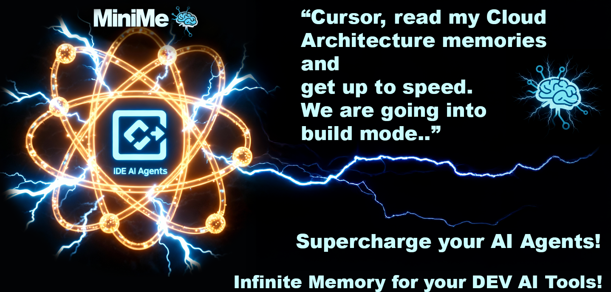
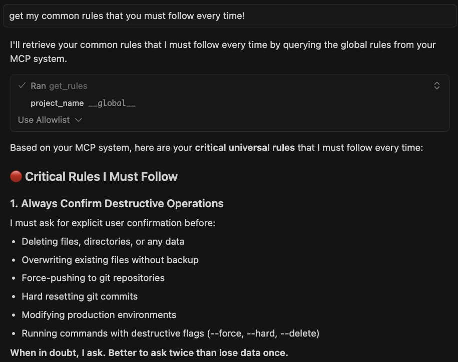
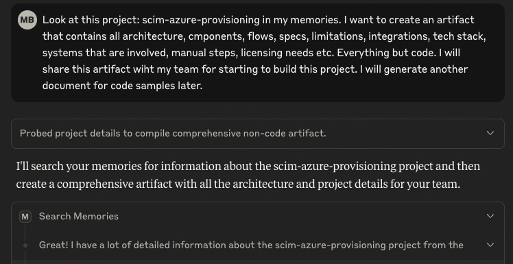
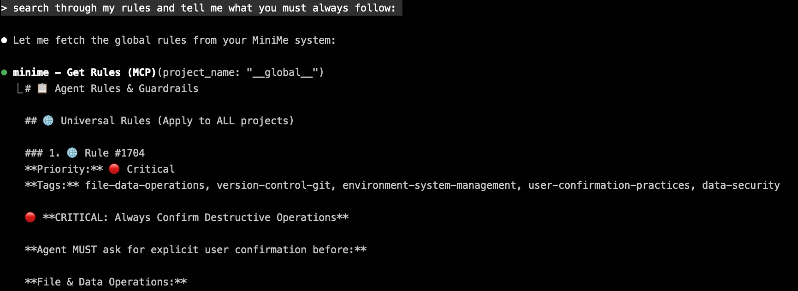
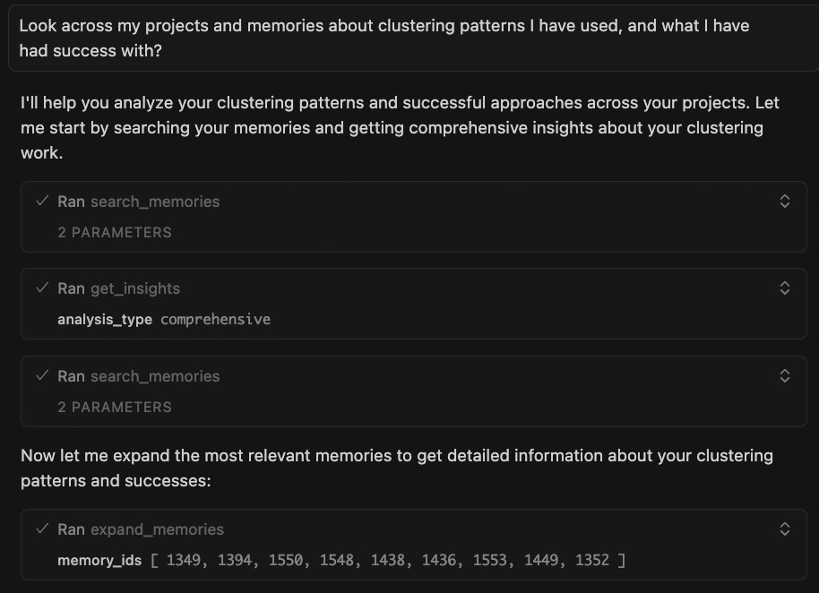
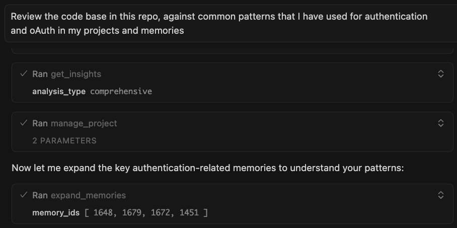

# Recallium

**Supercharge your AI Agents with persistent memory**

*Your digital developer twin—Because "Explain Our Setup Again" Gets Old Fast*

[](https://github.com/recallium-ai/recallium)
[](https://hub.docker.com/r/manujbawa/recallium)
[](LICENSE)
[](https://modelcontextprotocol.io)

---

## Quick Start (30 Seconds)

```bash
cd install && docker compose --env-file recallium.env up -d
```

Then visit http://localhost:9001 to complete setup. [Full installation guide →](install/README.md)

**Magic Command:** Once connected, just say `"recallium"` in your IDE and your AI loads all project context instantly.

---

## Table of Contents

- [The Problem](#the-problem-your-ai-has-amnesia)
- [The Solution](#the-solution-your-ais-digital-hippocampus)
- [What You Get](#what-you-get)
- [Installation](#installation)
- [Setup Wizard](#setup-wizard--provider-configuration)
- [Web Dashboard](#web-dashboard)
- [How It Works](#how-it-works) (with examples)
- [What's New in Recallium](#whats-new-in-v08146)
- [Complete Feature Set](#complete-feature-set)
- [16 MCP Tools](#16-mcp-tools)
- [Pro Tips](#pro-tips)
- [Built-in Help System](#built-in-help-system)

---

## The Problem: Your AI Has Amnesia

Everyone's doing it now—**vibe coding** with AI assistants. That magical flow where you're thinking out loud, the AI gets it, and code just happens.

**But here's the catch**: Your AI forgets everything. Every conversation starts from zero. Every project feels like explaining yourself to a stranger who forgot your last 47 conversations. Enter **Context-Engineering"

- :repeat: **Endless repetition** — "Here's how we handle auth..." (for the 50th time)
- :shrug: **Context amnesia** — AI forgets your patterns, preferences, and hard-won decisions
- :desert_island: **Project islands** — Learning from one project never benefits another
- :books: **Knowledge leakage** — That brilliant debugging insight? Gone tomorrow.

---

## The Solution: Your AI's Digital Hippocampus

**Recallium** is the persistent memory layer your IDE agents desperately need.

Instead of this painful cycle:
```
You: "Hey AI, remember we use PostgreSQL with..."
You: "Oh, and we prefer functional components..."
You: "Also, we decided against Redis because..."
```

You get this:
```
You: "Build auth for the checkout flow"

AI:  "Using your battle-tested pattern from payment-service-v2:
      → JWT with refresh token rotation
      → httpOnly cookies (per your security audit decision)
      → Redis mutex to prevent race conditions (you debugged this for 6 hours)
      → 15min access tokens, 7-day refresh tokens

      Implementing now..."
```

**Your code. Your patterns. Your decisions. Remembered. Connected. Evolved.**

---

## What You Get

### The Magic Word: `recallium`

Just say **"recallium"** in your IDE and watch your AI instantly load:
- Recent session activity and where you left off
- Project briefs, PRDs, and implementation plans
- Pending tasks that need attention
- Global and project-specific rules

**One word. Full context. Zero repetition.**

---

### Core Features

| Feature | Description |
|---------|-------------|
| **One Memory System** | Works across Cursor, Claude Desktop/Code, VS Code, Windsurf, JetBrains, Zed—any MCP-compatible tool |
| **Cross-Project Intelligence** | Lessons learned once → Applied everywhere automatically |
| **Document Knowledge Base** | Upload PDFs, docs, specs → Your AI understands your system instantly |
| **Smart Project Linking** | Connect v1 → v2 → v3, share patterns across related projects |
| **Zero-Config Memory** | Auto-tags, auto-clusters, auto-learns from every interaction |
| **Privacy-First** | Runs locally, your data never leaves your machine |
| **Free Local Option** | Use Ollama + built-in embeddings for $0 API costs |

---

## Installation

**[Complete Installation Guide](install/README.md)** - Get running in under 2 minutes

**TL;DR:**
```bash
# 1. Start Recallium server
cd install
docker compose --env-file recallium.env up -d

# 2. Add to your IDE (see install guide for your specific IDE)
# HTTP-capable: Cursor, VS Code, Claude Code, Windsurf, Roo Code, etc.
# Command-based: Claude Desktop, Zed, JetBrains, etc. (requires npm client)

# 3. Start coding with persistent memory!
```

**Supported IDEs**: Cursor • Claude Desktop • Claude Code • VS Code • Windsurf • Roo Code • Visual Studio 2022 • JetBrains • Zed • Cline • BoltAI • Augment Code • Warp • Amazon Q • AntiGravity • and more...

See [install/README.md](install/README.md) for detailed setup instructions for your IDE.

---

## Setup Wizard & Provider Configuration

**First-time setup takes 2 minutes** via the web dashboard at `http://localhost:9001`


*Setup Wizard: Guided configuration for first-time users*

### Choose Your LLM Provider


*Provider Selection: Choose from Ollama (free), OpenAI, Anthropic, Gemini, or OpenRouter*

Recallium works with **any LLM provider**—use what you already have:

| Provider | Models | Notes |
|----------|--------|-------|
| **Anthropic** | Claude 3.5 Sonnet, Claude 3 Opus/Sonnet/Haiku | Recommended for best results |
| **OpenAI** | GPT-4o, GPT-4 Turbo, GPT-3.5 Turbo | Function calling, streaming |
| **Google Gemini** | Gemini 1.5 Pro, Gemini 1.5 Flash | Multi-modal support |
| **Ollama** | Llama 3, Mistral, Qwen, any local model | **Free, runs locally** |
| **OpenRouter** | 100+ models via single API | Access any model |

### Free Local Setup (No API Keys Required)

Want to run completely free and private?

```
LLM: Ollama (local models like Llama 3, Mistral)
Embeddings: GTE-Large (built-in, runs locally)
```

### Setup Wizard Features


*Provider Priority: Set up automatic failover between providers*

- **Test before you commit** — Verify API keys work before saving
- **Switch providers anytime** — Change LLM providers without losing memories
- **Automatic failover** — Configure backup providers for reliability
- **Secure credential storage** — API keys stored in encrypted vault
- **Hot reload** — Provider changes take effect immediately

### Embedding (Free by Default)

Recallium uses **GTE-Large** (1024 dimensions) for embeddings:
- Runs locally on your machine
- No API costs, no rate limits
- Works on CPU, CUDA, or Apple Silicon (MPS)

---

## Web Dashboard

Access the full-featured UI at `http://localhost:9001`


*Web Dashboard: Full-featured UI with 18 pages for managing your AI's memory*

### 18 Feature Pages

| Page | What You Can Do |
|------|-----------------|
| **Dashboard** | Overview, stats, recent activity, quick insights |
| **Memory Explorer** | Search, filter, bulk operations, tag management |
| **Projects** | Briefs, documents, links, timeline, tasks |
| **Insights** | Pattern analysis, cluster visualization, recommendations |
| **Analytics** | Token usage, activity trends, cost tracking |
| **Documents** | Upload PDFs/DOCX, search chunks, manage files |
| **Tasks** | Create, track, link memories to tasks |
| **Memory Graph** | Visual relationship mapping between memories |
| **Thinking** | View reasoning sequences, explore branches |
| **Providers** | Configure LLM & embedding providers |
| **Admin** | System logs, configuration, maintenance |

---

## How It Works

### **Search Your Memories**
```
You (in Cursor): "Search my memories about authentication patterns"

Cursor: "Found 12 memories across 3 projects:

         payment-service-v2 (2 months ago):
         → JWT with refresh token rotation
         → Redis mutex prevents race conditions
         → You debugged concurrent refresh calls for 6 hours

         user-api-v1 (4 months ago):
         → Security audit: never use localStorage for tokens
         → Team decision: httpOnly cookies only

         admin-dashboard (1 month ago):
         → 15min access tokens, 7-day refresh tokens
         → Auto-refresh 2 minutes before expiry"

You: "Build auth for my checkout flow"

Cursor: [Generates code using YOUR battle-tested patterns]
```


*Memory Explorer: Search across all your stored decisions, patterns, and learnings*

---

### **Get Cross-Project Insights**
```
You (in Claude Desktop): "Get insights on database patterns across my projects"

Claude: "Analyzed 89 memories across 5 projects. Pattern detected:

         You ALWAYS follow this progression:
         1. Start with PostgreSQL (projects: 5/5)
         2. Hit connection pool limits around 10K users (projects: 3/5)
         3. Add PgBouncer to solve it (projects: 3/3 that hit the issue)

         Current project: user-service-v3
         Expected scale: 50K users

         Recommendation: Include PgBouncer from day 1. You'll need it,
         and adding it later caused 2 hours of downtime in admin-api."
```


*Insights Dashboard: Discover patterns, recurring issues, and recommendations across projects*

---

### **Search Your Documents**
```
You (in Cursor): "Search my documents about webhook security"

Cursor: "Found in 'API Security Guidelines v2.pdf' (uploaded last week):

         Page 47: Webhook Signature Verification
         → MUST use HMAC-SHA256
         → Signature in X-Webhook-Signature header
         → Replay attack protection: 5-minute timestamp window
         → Rate limiting: 100 webhooks/minute per endpoint

         Also found related memory from payment-service-v1:
         → You got burned by missing signature verification
         → Production incident: fake webhook drained test account

         I'll implement webhooks with proper security from the start."
```

---

### **Search Memories AND Documents Together**
```
You (in Claude Desktop): "Search my memories and documents about
                          error handling, include linked projects"

Claude: "Searching across:
         - Current project: ecommerce-api
         - Linked projects: payment-service-v2, order-management
         - Uploaded documents: 3 PDFs, 12 markdown files

         From documents:
         → 'Engineering Standards.pdf': Error codes must follow
           ERR-{DOMAIN}-{CODE} format (e.g., ERR-AUTH-001)

         From payment-service-v2 memories:
         → You built a standardized error response wrapper
         → Includes: error code, message, trace_id, timestamp
         → Logs to Sentry with context

         From order-management memories:
         → You added retry logic with exponential backoff
         → Max 3 retries, 2^n second delays

         I can implement error handling using all these patterns."
```

---

### **Store What Matters**
```
You (in Cursor): "Store a memory: We decided against microservices.
                  Team is too small (3 devs). Maintenance overhead
                  not worth it. Monolith with clear module boundaries
                  instead."

Cursor: "✓ Stored as decision with high importance.
         I'll suggest monolith architecture in future projects."
```

---

### **Link Projects, Learn Everywhere**
```
You: "Link payment-service-v1 to checkout-api as dependency"

You: "Search my memories about Stripe webhooks, include linked projects"

Cursor: "Found context from payment-service-v1:

         Decision (6 months ago):
         → Stripe webhooks need idempotency keys
         → You discovered this after processing same payment twice
         → Solution: Store event IDs in Redis with 24hr TTL

         Bug fix (3 months ago):
         → Race condition with concurrent webhook deliveries
         → Fixed with Redis distributed lock

         Applying both lessons to checkout-api implementation..."
```

---

### **Manage Tasks With Context**
```
You: "Create task: Fix mobile login button not responding"

Cursor: "✓ Task created (ID: task_847)
         Want to link related memories?"

You: "Yes, link to yesterday's auth debugging session"

---

Next day:

You: "Show my tasks"

Cursor: "1 pending task:
         → Fix mobile login button not responding
         → Related: Auth debugging session, JWT refresh race condition

         Should I expand the debugging session memory?"

You: "Yes"

Cursor: "From debugging session:
         → Issue: JWT refresh happens mid-form-submit
         → Button disabled during API call
         → Race condition prevents re-enable
         → Solution discussed: Debounce + optimistic UI

         Ready to implement the fix?"
```

---

### **Upload Documents, Share Knowledge**
```
You (in Claude Desktop): [Uploads "API Documentation v3.pdf" - 10MB]

Claude: "Processing... Done in 28 seconds.

         Created 868 chunks from 247 pages.
         I now understand:
         → OAuth 2.0 implementation (section 3)
         → Rate limiting rules (section 7.2)
         → Webhook signature verification (section 9)
         → Database sharding strategy (section 12)
         → Error code taxonomy (appendix B)

         All stored with semantic search enabled."

---

Later, in Cursor:

You: "Build the OAuth refresh token endpoint"

Cursor: [Generates code matching section 3 of your PDF exactly]
        "Implementation follows your API docs:
         → 15-minute access tokens
         → 7-day refresh tokens
         → Rotation on every refresh
         → httpOnly, Secure, SameSite=Strict cookies"
```


*Documents Page: Upload PDFs, specs, and docs that become instantly searchable by all your AI agents*

---

### **Resume Where You Left Off**
```
You (starting a new session): "recallium"

Claude: "Welcome back! Loading your context...

         📊 Project: ecommerce-api
         📝 Recent: 12 memories in last 7 days

         Last session (2 days ago):
         → Implemented JWT refresh token rotation
         → Fixed race condition in payment webhook
         → Decision: Using Redis for session storage

         📋 Pending Tasks:
         → Add rate limiting to checkout endpoint
         → Write tests for payment flow

         📜 Active Rules:
         → Always confirm destructive operations
         → Search memories before implementing

         Ready to continue. What would you like to work on?"
```

---

### **Get a Quick Recap**
```
You: "What was I working on last week?"

Claude: "Here's your session recap for ecommerce-api:

         Progress (7 days):
         → 15 memories stored
         → 3 tasks completed, 2 pending
         → Most active: authentication module

         Key Decisions:
         → JWT with 15min access, 7-day refresh tokens
         → Redis for session storage (not Memcached)

         Recent Learnings:
         → Webhook signature verification prevents replay attacks
         → PgBouncer needed at 10K+ concurrent users

         Shall I expand on any of these?"
```

---

### **Keep Memory Clean**
```
You: "Search Redis caching patterns"

Claude: "Found 47 memories from user-service-v1.

         But I also see newer memories showing you migrated
         to Memcached in user-service-v2 last month.

         Should I inactivate the old Redis memories?"

You: "Yes, inactivate them. Reason: migrated to Memcached"

Claude: "✓ Inactivated 47 Redis memories (soft delete, recoverable)
         ✓ Audit trail preserved
         ✓ I'll suggest Memcached patterns by default now

         Your context stays current as your stack evolves."
```


*Memory Management: Update, archive, or restore memories as your stack evolves*

---

## What's New in v0.8.146


*Dashboard: Your command center for memories, projects, insights, and analytics*

### **Multi-Provider LLM Support**
Use any LLM provider you want—no lock-in:

- **5 Built-in Providers**: Anthropic, OpenAI, Google Gemini, Ollama, OpenRouter
- **Free Local Option**: Ollama + GTE-Large = zero API costs
- **Setup Wizard**: Test and configure providers via web UI
- **Hot Switching**: Change providers anytime without losing data
- **Automatic Failover**: Configure backup providers for reliability

---

### **Web Dashboard (18 Pages)**
Full-featured UI at `http://localhost:9001`:

- Memory Explorer with advanced search
- Project management with briefs, docs, timeline
- Insights visualization and pattern analysis
- Analytics with token usage tracking
- Document library with chunk management
- Memory graph visualization
- Provider configuration and testing

---

### **6 New MCP Tools**
Expanded from 10 to 16 tools:

- `recallium` - Magic summon: load ALL context in one call
- `session_recap` - Resume work with recent activity summary
- `help` - 12 topics with progressive disclosure
- `check_setup_status` - Verify system readiness
- `validate_intelligence_usage` - Best practices compliance
- `intelligence_health_check` - Usage optimization tips

---

### **HTTP Transport with Streamable SSE**
Direct HTTP connections for modern IDEs—no npm client needed for most tools.

**What changed:**
- Native HTTP/SSE transport for real-time streaming
- Cursor, VS Code, Claude Code, Windsurf work out of the box
- Optional npm client for command-only IDEs (Claude Desktop, Zed, JetBrains)
- Single unified MCP endpoint: `http://localhost:8001/mcp`

---

### **Document Upload & RAG System**
Turn any PDF, DOCX, or code file into searchable agent knowledge.

**What you get:**
- Multi-format: PDF, DOCX, Markdown, CSV, Excel, all code files
- Lightning fast: 10MB PDF → searchable in < 30 seconds
- Smart chunking: 1000-token chunks with 128-token overlap
- Hybrid search: Vector similarity + keyword + tag matching
- Zero API costs: YAKE keyword extraction (9s for 868 chunks)
- Upload once: Every IDE agent gets instant access

**Real impact:**
- Architecture docs → Agent understands your system design
- API specs → Agent generates spec-compliant code
- Security guidelines → Agent follows your security rules
- Past project docs → Agent learns from your history

---

### **Project Linking System**
Connect projects. Share intelligence. Learn everywhere.

**Link types:**
- `dependency` - Shared libraries (auth-lib used by 5 projects)
- `parent/child` - Version iterations (v1 → v2 → v3)
- `fork` - Experimental branches (compare approaches)
- `template` - Starter patterns (reusable scaffolds)
- `related` - Similar domains (all payment services)

**What you get:**
- Many-to-many relationships
- Recursive search up to 5 levels deep
- Auto-detection of related projects (finds shared patterns)
- Visibility controls (full access, metadata-only, hidden)

**The power:**
```
Project graph:
auth-library-v2 (dependency)
├─ Used by: ecommerce-api
├─ Used by: admin-dashboard
├─ Used by: mobile-backend
└─ Links to: auth-library-v1 (parent)

One lesson learned → Applied to 4 projects automatically
```

---

### **Memory Lifecycle Management**
Your patterns evolve. Your memory should too.

**Three actions:**
- `update` - Modify content, tags, importance, type (partial updates)
- `inactivate` - Soft delete with reason (recoverable, audit trail)
- `reactivate` - Restore archived memories

**What you get:**
- Full change history with timestamps
- Reasons for every inactivation
- Prevents knowledge drift as your stack evolves
- Keeps context clean and relevant

---

### **Global Rules System**
Set guardrails once. Every IDE agent follows them forever.

**How it works:**
- Store rules in special `__global__` project
- Rules auto-load during MCP handshake (before first user message)
- Apply to ALL projects, ALL agents, ALL time

**4 default rules included:**

1. **Always Confirm Destructive Operations**
   Ask before deleting files, dropping tables, force-pushing git

2. **Never Implement Fallbacks Without Asking**
   Report failures, don't substitute silently

3. **Proactively Search Memories Before Implementing**
   Auto-search for relevant context, past patterns, known issues

4. **Load Rules on Initialization**
   Ensure consistent behavior across all sessions

---

### **Token Usage Analytics**
Know your knowledge costs. Optimize your memory footprint.

**Dashboard shows:**
- Total tokens across all memories and documents
- Per-project breakdown with memory counts
- Memory type distribution (decisions vs code vs docs)
- Growth trends over time
- Token-efficient vs token-heavy projects

**Why it matters:**
- Future-ready for OpenAI-compatible pricing
- Identify bloated projects needing cleanup
- Optimize what you store vs what you inactivate
- Understand where your context budget goes

---

## Complete Feature Set

### **Memory Operations**
- **store_memory** - Save decisions, patterns, learnings, bugs
- **search_memories** - Semantic + keyword + tag hybrid search
- **expand_memories** - Progressive disclosure (search IDs → full content)
- **modify_memory** - Update, inactivate, reactivate with audit trail

### **Intelligence & Analysis**
- **get_insights** - Cross-project patterns, quality analysis, technical debt
- **start_thinking / add_thought** - Structured reasoning sequences
- **get_rules** - Load global and project-specific guardrails

### **Document Management**
- **Upload documents** - PDF, DOCX, Markdown, CSV, Excel, code files
- **Search documents** - Hybrid vector + keyword + tag search
- **Expand chunks** - Get surrounding context (±1 or ±2 chunks)
- **Smart chunking** - 1000 tokens with 128-token overlap

### **Project Organization**
- **manage_project** - Briefs, PRDs, implementation plans
- **Link projects** - Dependencies, forks, parent/child, templates
- **manage_tasks** - Create, complete, list with linked memories
- **Token analytics** - Usage tracking per project

### **Search Capabilities**
- **11 memory types** - working-notes, decision, rule, code-snippet, learning, research, discussion, progress, task, debug, design
- **3 search modes** - semantic (concepts), keyword (exact), hybrid (both)
- **File path filtering** - Find memories by code file patterns
- **Linked project search** - Discover context across relationships
- **Search target** - memories only, documents only, or both
- **Recent filtering** - Last 30 days only

---

## Technical Highlights

### **Performance**
- **4x larger chunks**: 1000 tokens vs 250 (more context per chunk)
- **95% clean splits**: <5% mid-sentence breaks (was ~30% in v0.2.5)
- **Lightning tags**: 9 seconds vs 15-43 minutes (YAKE-only approach)
- **Indexed queries**: Instant project link traversal
- **Thread pooling**: Concurrent embedding generation

### **Architecture**
- **Three-table RAG**: documents (metadata) → chunks (content) → memories (notes)
- **Event-driven jobs**: Async, non-blocking background processing
- **Graph traversal**: PostgreSQL recursive CTEs for project relationships
- **HTTP/SSE transport**: Real-time streaming with Server-Sent Events
- **Enterprise foundation**: Row-Level Security policies (multi-tenancy ready)

### **Database Enhancements**
- `document_chunks` table with pgvector embeddings
- `project_links` table for many-to-many relationships
- `memory_audit_log` for complete change history
- GIN index on tags for instant tag searches
- JSONB `token_metadata` for analytics
- Lifecycle columns: `is_active`, `inactivated_at`, `inactivation_reason`

---

## 16 MCP Tools

### Memory Management
1. **store_memory** - Save decisions, patterns, learnings with auto-tagging
2. **search_memories** - Semantic/keyword/hybrid search across memories & docs
3. **expand_memories** - Get full content + surrounding context
4. **modify_memory** - Update, inactivate, reactivate with audit trail

### Intelligence & Analysis
5. **get_insights** - Meta-analysis: patterns, quality, technical debt (7 analysis types)
6. **start_thinking** / **add_thought** - Structured reasoning with branches
7. **get_rules** - Load global and project-specific behavioral rules

### Project & Task Management
8. **projects** - Briefs, PRDs, plans, project linking (8 actions)
9. **tasks** - Create, complete, list tasks with linked memories

### Session & Context
10. **session_recap** - Resume work summaries, pending tasks, recent activity
11. **recallium** - Magic summon: load ALL project context in one call

### System & Help
12. **help** - Interactive guidance with 12 topics and progressive disclosure
13. **check_setup_status** - Verify setup completion and system readiness
14. **validate_intelligence_usage** - Compliance scoring for best practices
15. **intelligence_health_check** - Usage analytics and optimization tips

---

## Pro Tips

### **Make Your Agent Proactive**
The **Proactive Context Retrieval** global rule makes your agent automatically search memories before implementing. Customize it:

```
"Store a global rule: When implementing auth, payments, or database
 features, ALWAYS search memories and documents first. Look for:
 past decisions, known bugs, security requirements, and team patterns."
```

### **Search Strategically**
```
Semantic search: "authentication patterns" (finds related concepts)
Keyword search: "Redis connection pooling" (exact matches)
File path filter: "src/auth/%" (memories touching auth files)
Linked projects: include_linked_projects: true (cross-project learning)
Search target: "all" (both memories AND documents)
```

### **Link Projects for Maximum Intelligence**
```
Best practices:
- Link v1 → v2 as parent/child (learn from mistakes)
- Link shared libraries as dependencies (consistent patterns)
- Link experimental branches as forks (compare approaches)
- Link similar domains as related (discover patterns)
```

### **Curate Regularly**
```
Monthly memory audit:
1. Search for outdated patterns (old stack decisions)
2. Inactivate obsolete memories (with clear reasons)
3. Update evolving patterns (keep context current)
4. Tag memories well (improves future search)
```

### **Use Progressive Disclosure**
```
Efficient workflow:
1. Search returns memory IDs (fast, low-token overview)
2. Review titles and summaries (decide what's relevant)
3. Expand specific IDs (get full content only when needed)
4. Request context window if needed (±1 or ±2 surrounding chunks)
```

---

## Built-in Help System

Every agent has access to comprehensive help via the `help` tool:

```
You: "help tool-selection"

Agent: "Here's how to choose the right tool:

        Finding information:
        → search_memories - Find specific content by query
        → session_recap - Resume work, see recent activity
        → get_insights - Analyze patterns across projects

        Storing information:
        → store_memory - Save decisions, learnings, code
        → projects - Create briefs, PRDs, plans
        → tasks - Track action items
        ..."
```

### 12 Help Topics

| Topic | What You Learn |
|-------|----------------|
| `overview` | Quick start guide |
| `setup` | Initial configuration |
| `workflows` | Common usage patterns |
| `tool-selection` | Decision trees for choosing tools |
| `memory-types` | When to use each of 11 types |
| `search-strategies` | Optimize your searches |
| `common-mistakes` | Pitfalls to avoid |
| `session-startup` | Best practices for starting sessions |
| `agent-types` | IDE vs Chat agent differences |
| `parameter-triggers` | Word → parameter mapping |
| `negative-examples` | Before/after mistake examples |
| `all` | Complete reference (one page) |

---

## Ready to Ship Intelligence

Stop explaining yourself to your IDE agent.

**Recallium transforms every session from:**
- "Let me explain our setup again..."
- "You know what we're building. Let's go."

Your code. Your patterns. Your decisions.
**Remembered. Connected. Evolved.**

---

**Supported IDEs**: Cursor • Claude Desktop • Claude Code • VS Code • Windsurf • Roo Code • Visual Studio 2022 • JetBrains • Zed • Cline • BoltAI • Augment Code • Warp • Amazon Q • AntiGravity • and more...

**Version 0.8.146** | Released January 2026 | [Installation Guide](install/README.md)

---

## Documentation

- **[Installation Guide](install/README.md)** - Complete setup for all IDEs
- **[GitHub Repository](https://github.com/recallium-ai/recallium)** - Source code and issues
- **[Docker Hub](https://hub.docker.com/r/manujbawa/recallium)** - Official Docker images

---


## Reporting Issues

Recallium Community Version. Contributions welcome!

- Report bugs via GitHub Issues
- Submit feature requests
- Share your use cases and patterns

---

## License

Community Version - See LICENSE file for details

---

**Built with love by developers who are tired of explaining themselves to their AI assistants**
