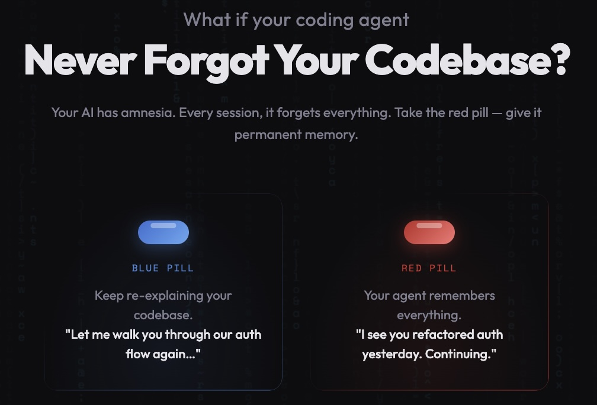
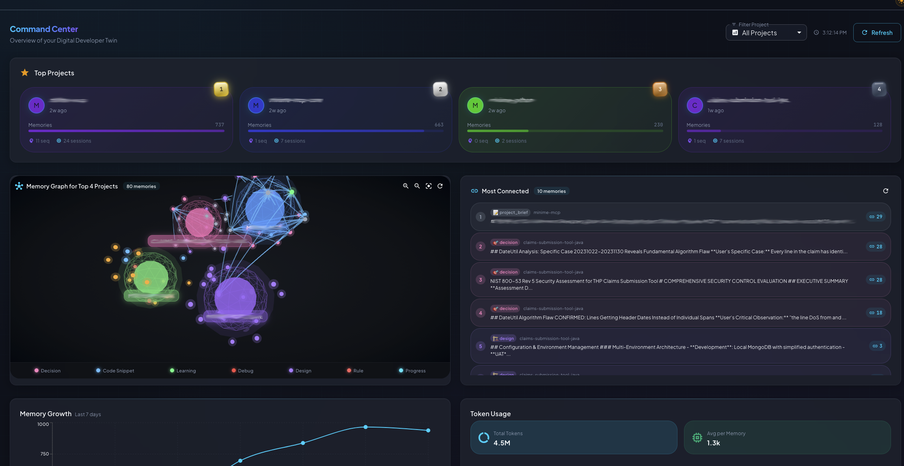
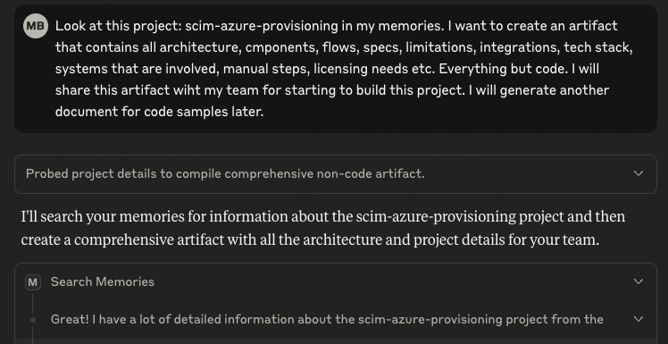
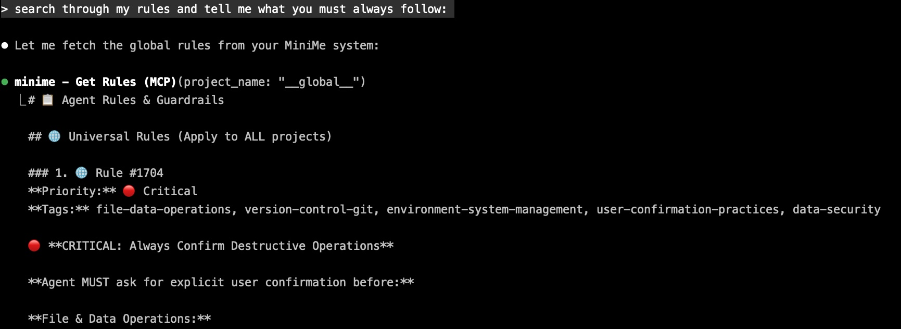
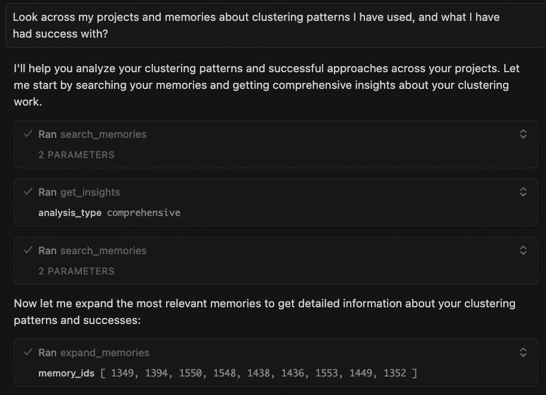
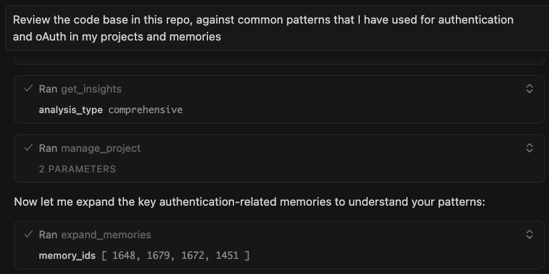
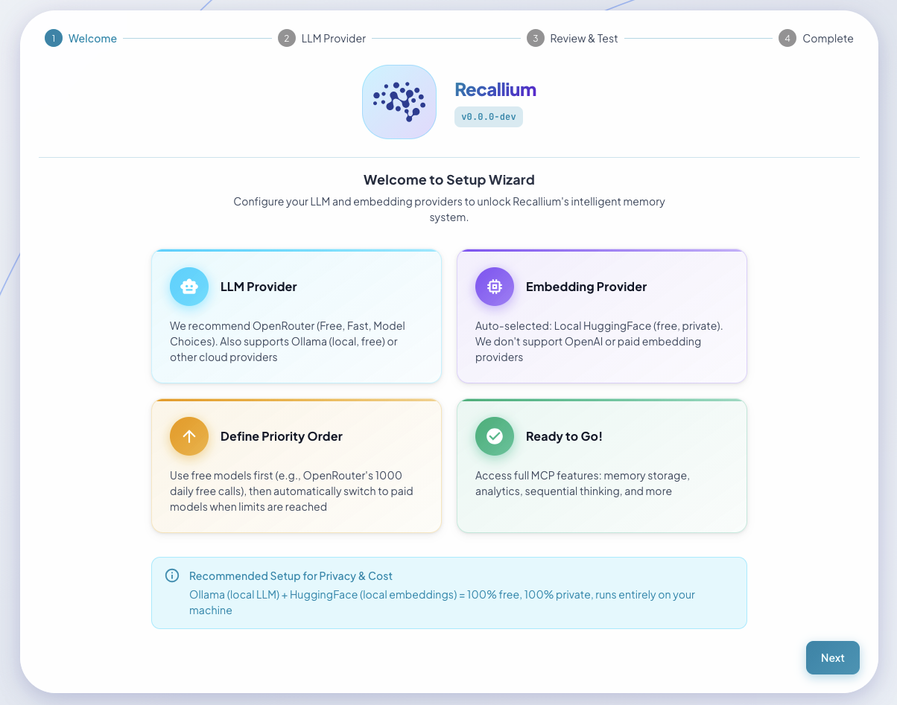
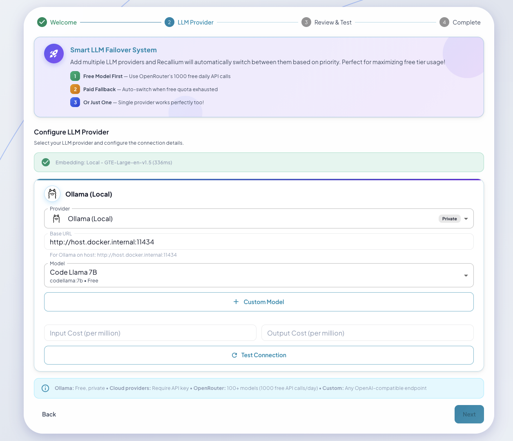
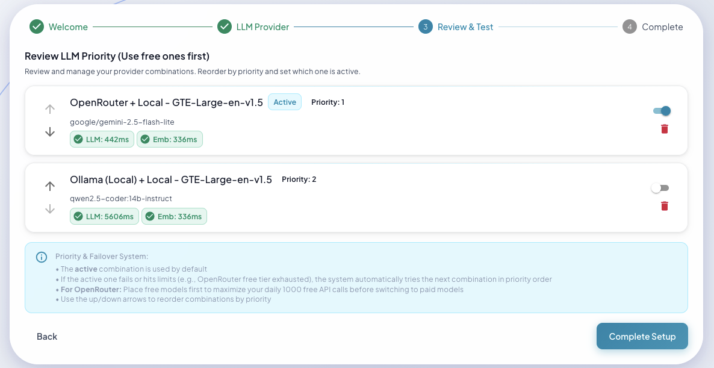

# Recallium

**The memory OS for AI coding agents.**

*Your digital developer twin — because "explain our setup again" gets old fast.*

[](https://github.com/recallium-ai/recallium/releases)
[](https://hub.docker.com/r/recalliumai/recallium)
[](LICENSE)
[](https://modelcontextprotocol.io)
[](https://claude.ai/code)
[](https://cursor.sh)
[](https://codeium.com/windsurf)

---

It's Wednesday. Your agent just asked you to re-explain your auth architecture.
You explained it on Monday.

Recallium fixes this — because it was built for developers, not for generic chat.

---

## Built for developers. Not chat agents.

Memory only works when it understands context.

A doctor's memory looks nothing like a customer service agent's. And neither
looks like a developer's. Developers work in projects, make reversible decisions,
debug recurring patterns, and build on choices made months ago. Generic memory
tools don't understand any of that.

Recallium is built around the way developers actually work:

- **Projects are the unit of context** — memories are scoped, isolated, and retrieved per project
- **Memory types reflect real developer artifacts** — decisions, debug sessions, research, in-progress work, rules, code patterns
- **Search is tuned for engineering queries** — finding the reason behind a past choice, not just matching keywords
- **Session continuity is automatic** — your agent knows what sprint you're in, what's pending, and where you left off

This isn't a general-purpose memory layer that happens to support developers.
It's a memory OS designed around the developer's cognitive workflow from the ground up.

---

## What it is

Recallium is a persistent memory layer for AI coding agents, delivered as an MCP
server. It works with Claude Code, Cursor, Windsurf, and any MCP-compatible tool.

Most memory tools save text and search it. Recallium knows *what kind* of thing
it's storing, *which project* it belongs to, and *how to find it* when your agent
needs it — across every session, every restart, every context compaction.


*Your command center — memories, projects, insights, and activity across every coding session.*

---

## The magic word

Just say **`recallium`** in your IDE. Your agent instantly loads:

- Where you left off and what's in progress
- Recent decisions, debug sessions, open tasks
- Project briefs, PRDs, and implementation plans
- Global and project-specific rules

**One word. Full context. Zero repetition.**

---

## What makes it different

| | Other MCP memory tools | Recallium |
|---|---|---|
| Designed for | General use | Developer workflows specifically |
| Memory model | Flat — text + tags | Typed — each memory has a category that shapes how it's stored and retrieved |
| Project scoping | Global pool | Isolated per project, cross-project intelligence available |
| Search precision | Vector similarity | Finds what you mean even when the words don't match — never returns zero results |
| Session continuity | You figure it out | `session_recap` tells your agent exactly where it left off |
| Agent rules | No | Per-project and global behavioral guardrails |
| Structured reasoning | No | Agents reason in sequences stored as decisions |
| Task tracking | No | Tasks linked directly to project memories |
| Cross-project learning | No | Lessons learned once, applied everywhere |
| Enterprise | No | RBAC, compliance, air-gapped deployment |

---

## Memory types

Recallium knows the difference between a debugging session, an architecture
decision, and work in progress. Storing the right type means retrieving the
right thing later.

| Type | What it captures |
|---|---|
| `decision` | Architecture choices, tradeoffs, rejected alternatives |
| `debug` | Root cause, fix applied, files changed |
| `progress` | Where you left off, what's done, what's next |
| `feature` | Design notes, implementation approach |
| `research` | Findings, evaluations, references |
| `code-snippet` | Working patterns, reusable solutions |
| `rule` | Agent behavioral guardrails, per-project or global |
| `learning` | Lessons discovered, gotchas, hard-won insights |
| `discussion` | Team decisions, retro notes, context |
| `design` | Architecture diagrams, system design notes |
| `working-notes` | Scratch pad, temporary context |

---

## Real workflows

### Search and apply past decisions

```
You:   "Build auth for the checkout flow"

Agent: "Using your battle-tested pattern from payment-service-v2:
        → JWT with refresh token rotation
        → httpOnly cookies (per your security audit decision)
        → Redis mutex to prevent race conditions (you debugged this for 6 hours)
        → 15min access tokens, 7-day refresh tokens

        Implementing now..."
```


*Search across all your stored decisions, patterns, and learnings — across every project.*

---

### Cross-project pattern intelligence

```
You:   "Get insights on database patterns across my projects"

Agent: "Analyzed 89 memories across 5 projects. Pattern detected:

        You ALWAYS follow this progression:
        1. Start with PostgreSQL (5/5 projects)
        2. Hit connection pool limits around 10K users (3/5)
        3. Add PgBouncer to solve it (3/3 that hit the issue)

        Current project: user-service-v3
        Expected scale: 50K users

        Recommendation: Include PgBouncer from day 1.
        Adding it later caused 2 hours of downtime in admin-api."
```


*Discover patterns, recurring issues, and recommendations across all your projects.*

---

### Resume where you left off

```
You:   "recallium"

Agent: "Welcome back! Loading your context...

        Project: ecommerce-api
        Recent: 12 memories in last 7 days

        Last session (2 days ago):
        → Implemented JWT refresh token rotation
        → Fixed race condition in payment webhook
        → Decision: Using Redis for session storage

        Pending Tasks:
        → Add rate limiting to checkout endpoint
        → Write tests for payment flow

        Active Rules:
        → Always confirm destructive operations
        → Search memories before implementing

        Ready to continue."
```

---

### Structured thinking — decisions that stick

```
You:   "Think through which auth approach to use"

Agent: "Starting a reasoning sequence...

        Analysis: JWT — stateless, edge-compatible, no server state needed
        Analysis: Sessions — easier revocation, but requires Redis at edge
        Conclusion: Going with JWT — edge requirement is non-negotiable

        ✓ Stored as a decision memory. Searchable forever."
```

---

### Upload documents, share knowledge

```
You:   [Uploads "API Security Guidelines v2.pdf"]

Agent: "Processing... Done in 28 seconds.
        868 chunks from 247 pages. I now understand:
        → OAuth 2.0 implementation (section 3)
        → Rate limiting rules (section 7.2)
        → Webhook signature verification (section 9)

        All stored with semantic search enabled."

---

Later, in Cursor:

You:   "Build the OAuth refresh token endpoint"

Agent: [Generates code matching your PDF exactly]
       "Implementation follows your API docs:
        → 15-minute access tokens
        → 7-day refresh tokens with rotation
        → httpOnly, Secure, SameSite=Strict cookies"
```


*Upload PDFs, specs, and docs that become instantly searchable by all your AI agents.*

---

### Agent rules engine

```
You:   "Store a rule: never run migrations without a rollback
        plan reviewed by the team"

Agent: "✓ Rule stored for payments-api.
        I'll load it automatically at the start of every session."
```

---

### Keep memory current

```
Agent: "Found 47 memories about Redis caching from user-service-v1.

        I also see you migrated to Memcached in user-service-v2 last month.
        Should I inactivate the old Redis memories?"

You:   "Yes. Reason: migrated to Memcached."

Agent: "✓ Inactivated 47 memories (soft delete, recoverable)
        ✓ Audit trail preserved
        ✓ Suggesting Memcached patterns by default now"
```


*Update, archive, or restore memories as your stack evolves.*

---

## RecallBench

Most memory benchmarks test whether an AI can recall what someone said in a
conversation. That's not how developer agents use memory.

**RecallBench** is a benchmark built specifically for developer agent memory.
Test memories are drawn from realistic engineering workflows — architecture
decisions, debugging sessions, sprint retrospectives, tradeoff evaluations —
not generic chat transcripts.

The benchmark tests what actually matters in practice:

- Does the agent find the right *decision* when facing a similar problem weeks later?
- Does it surface the relevant *debug session* when the same class of bug reappears?
- Does it scope retrieval correctly to the right project when memories from multiple codebases are in the pool?

This is a fundamentally different evaluation than LoCoMo or LongMemEval, which
measure verbatim recall across generic topics. Developer memory has its own
taxonomy — and it deserves its own benchmark.

Recallium is evaluated against RecallBench as its primary quality signal.

→ [recallbench.ai](https://recallbench.ai) *(coming soon)*

---

## Setup

**Requirements:** Docker

```bash
# macOS / Linux
cd install
chmod +x start-recallium.sh
./start-recallium.sh

# Windows
cd install
start-recallium.bat
```

Visit `http://localhost:9001` to complete setup.


*Guided setup — takes under 2 minutes.*

### Choose your LLM provider


*Anthropic, OpenAI, Gemini, Ollama, or OpenRouter — use what you already have.*

**Free local option:** Ollama + built-in embeddings. Zero API costs. Data never leaves your machine.


*Configure failover providers for reliability.*

### Connect your IDE

All modern IDEs connect via HTTP — no npm client needed:

```
http://localhost:8001/mcp
```

**Claude Code:**

```bash
claude mcp add --scope user --transport http recallium http://localhost:8001/mcp
```

**Supported IDEs:**
Cursor • Claude Code • Claude Desktop • VS Code • Windsurf • Roo Code •
Visual Studio 2022 • JetBrains • Zed • Cline • BoltAI • Augment Code •
Warp • Amazon Q • AntiGravity • and more

See the [full installation guide](install/README.md) for your IDE's exact config.

---

## Corporate & Air-Gapped Deployment

Running Recallium behind a corporate proxy or in an air-gapped environment?

**SSL Certificate Issues (Corporate Proxy)**

If you see `SSL: CERTIFICATE_VERIFY_FAILED` errors, your corporate proxy is likely
intercepting HTTPS traffic. Add to `recallium.env`:

```bash
DISABLE_SSL_VERIFY=1
```

⚠️ Only use in trusted corporate networks.

**Air-Gapped / Offline Mode**

For environments with no internet access:
1. Pre-download the embedding model on an internet-connected machine
2. Copy the cache to your air-gapped machine
3. Enable offline mode:

```bash
HF_HUB_OFFLINE=1
TRANSFORMERS_OFFLINE=1
```

See the [installation guide](install/README.md#ssl-certificate-errors-corporate-proxy--air-gapped-environments) for detailed instructions.

---

## Enterprise

Recallium Community is free under ELv2.

Recallium Enterprise adds RBAC, a compliance dashboard, air-gapped deployment,
and dedicated support.

GA: June 2026 → [recallium.ai/enterprise](https://recallium.ai/enterprise)

---

## Links

| | |
|---|---|
| Website | [recallium.ai](https://recallium.ai) |
| Setup guide | [recallium.ai/setup](https://recallium.ai/setup) |
| Changelog | [recallium.ai/changelog](https://recallium.ai/changelog) |
| Community | [r/Recallium](https://reddit.com/r/Recallium) |
| Docker Hub | [recalliumai/recallium](https://hub.docker.com/r/recalliumai/recallium) |
| Issues | [GitHub Issues](https://github.com/recallium-ai/recallium/issues) |

---

## License

Community: [Elastic License v2](LICENSE) — free to use and self-host.
You may not offer Recallium as a hosted service to third parties.

Enterprise: Commercial license available.
[recallium.ai/enterprise](https://recallium.ai/enterprise)

---

*Built by developers who got tired of explaining themselves to their AI assistants.*
<!--
persistent memory for AI coding agents
MCP memory server for developers
Claude Code persistent memory
Cursor persistent memory
Windsurf MCP memory
AI agent memory across sessions
developer memory OS
MCP server memory tool
persistent context for IDE agents
AI coding assistant memory
Claude Code MCP tools
agent memory for developers
memory that survives context window
structured memory for AI agents
developer workflow memory
project-scoped AI memory
cross-session memory for coding agents
AI memory benchmark developer workflows
RecallBench
-->