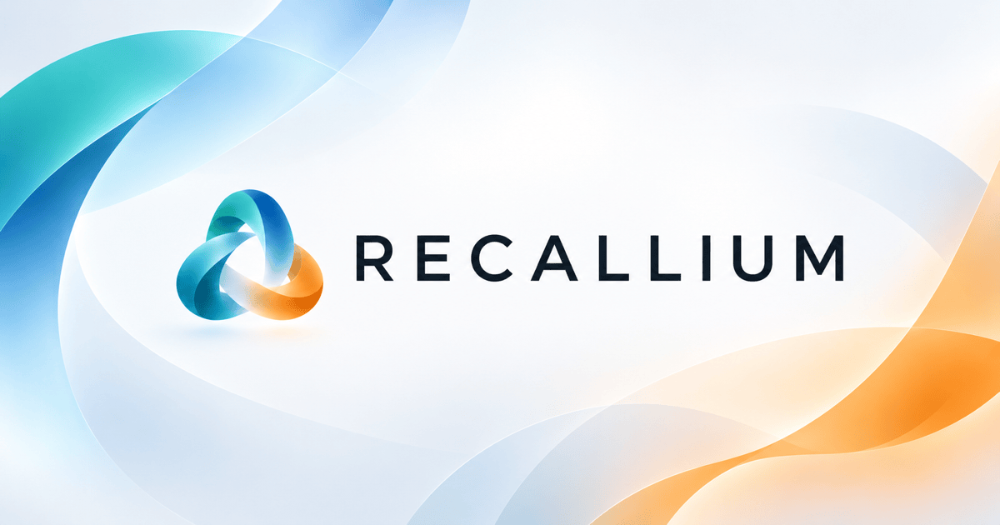
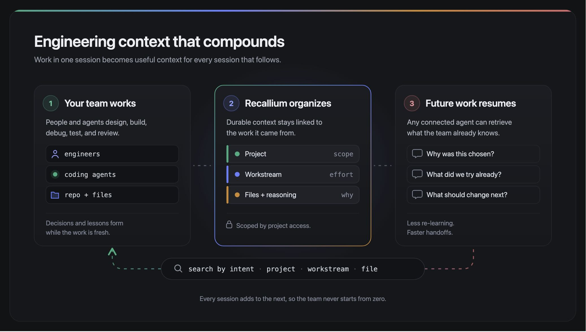
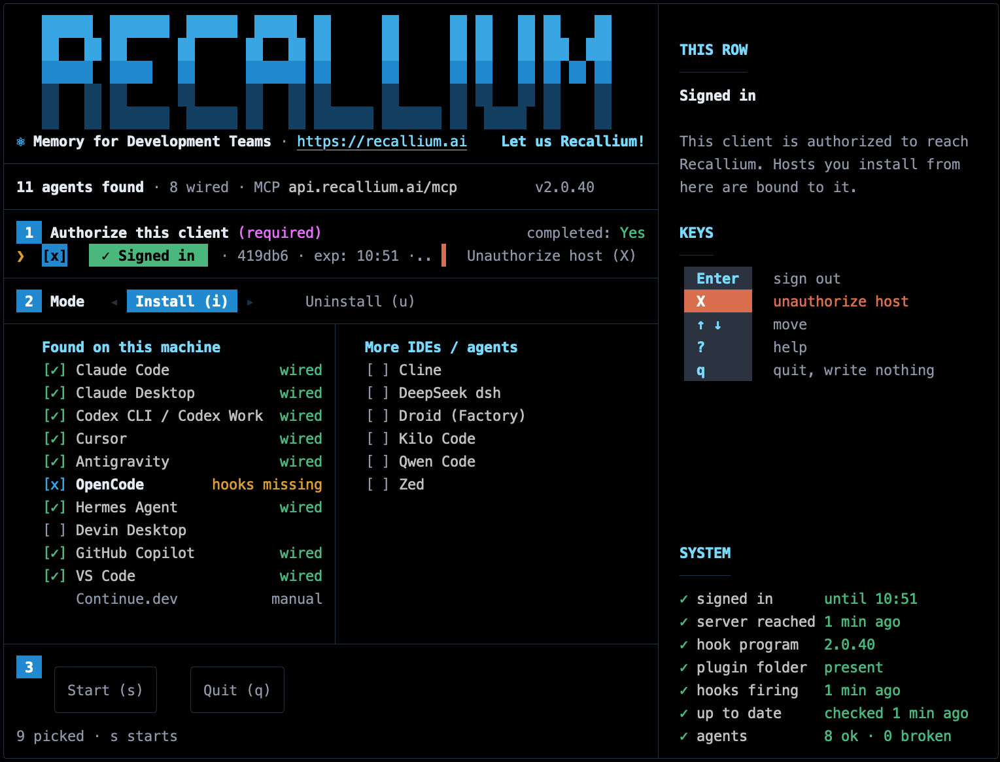
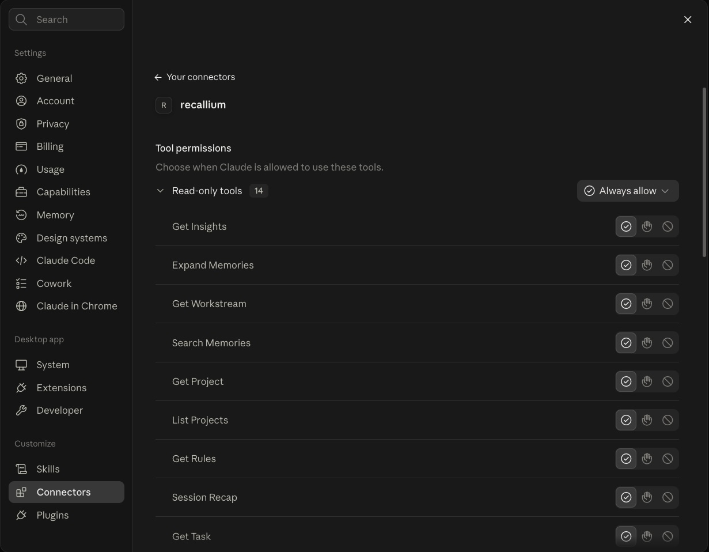

# Recallium

**Institutional engineering memory for humans and AI agents.**

Your code remembers what changed. Recallium remembers why.

[](https://recallium.ai)
[](https://docs.recallium.ai)
[](https://www.npmjs.com/package/recallium)
[](https://modelcontextprotocol.io)
[](https://recallium.ai/benchmarks)
[](LICENSE)

- [What Recallium is](#what-recallium-is)
- [Serving memory vs. engineering memory](#serving-memory-vs-engineering-memory)
- [How it works](#how-it-works)
- [Install](#install)
- [Use it from your coding agent](#use-it-from-your-coding-agent)
- [Projects and workstreams](#projects-and-workstreams)
- [Memory across the software lifecycle](#memory-across-the-software-lifecycle)
- [Supported coding agents and IDEs](#supported-coding-agents-and-ides)
- [Where it helps](#where-it-helps)
- [Rules files and Recallium](#rules-files-and-recallium)
- [Retrieval](#retrieval)
- [Privacy and data handling](#privacy-and-data-handling)
- [Pricing](#pricing)
- [FAQ](#faq)
- [Self-hosted community edition (formerly MiniMe MCP)](#self-hosted-community-edition-formerly-minime-mcp)
- [Links](#links)
- [License](#license)

## What Recallium is

Recallium is memory for the agents that do software development, such as Claude Code, Codex, Cursor, GitHub Copilot, Devin and Cline, and for the engineers who work beside them. It is served over the Model Context Protocol (MCP), so every coding tool on the team is a client of the same memory.

While an agent designs, decides, builds, debugs and ships, Recallium keeps the record it produces: the decision and the options rejected, the root cause and the fix, the constraint that drove a change, the rules the team follows, and where an effort stands. When a later session, another tool or a teammate's agent touches the same code, Recallium finds what the team already settled and feeds it to the agent before it starts. When one decision replaces another, agents follow the current one.

Teams also call this memory for development agents, developer agents, AI coding assistants or AI software engineering agents. All of those mean the agents that do the development work. Recallium is **not** a memory API for the end users of the product you ship; it is memory for the team that ships it.

## Serving memory vs. engineering memory

Every AI memory pitch sounds the same: your agent never forgets, persistent context, memory for AI. Two different products are sold under one word. **Serving memory** remembers the person your product talks to. **Engineering memory** remembers why your software is the way it is.

Serving memory lives in your product's runtime. A support bot remembers a customer's last three orders; a tutoring app remembers a student struggles with fractions. The unit of memory is a person, the job is personalization, the scale is millions of end users, so the bill is metered by requests and tokens. Engineering memory lives in your team's build process. The unit is a decision: what was chosen, what was rejected, the constraint that forced it, and what replaced it later. The readers are the engineers and coding agents building the product, so it is priced per engineer.

| | Serving memory | Engineering memory |
|---|---|---|
| Remembers | The person on the other side of the chat | Why the software is the way it is |
| Unit of memory | A fact about a user | A decision, a fix, a constraint, with its reasoning |
| Who reads it | Your product, on behalf of each end user | Every engineer and every coding agent on the team |
| What "current" means | The latest preference wins | The latest decision wins, and the old one stays on record |
| Scale | Millions of end users | One team, many repositories, many tools |
| Billed by | Requests, tokens, queries | Engineer |
| Cost of a stale memory | A slightly worse reply | A bug your security review already killed, shipped again |

That last row is the whole argument. In serving memory a stale fact is an annoyance; in engineering memory a stale fact is an incident. A stale memory is more dangerous than a missing one, which is why Recallium keeps the old decision on record and makes the current one explicit.

Mem0, Supermemory and Zep are serving memory, and good at it; Mem0 and Supermemory also ship Claude Code and Cursor plugins that remember the developer as a user. Letta builds stateful agents whose memory belongs to the agent. None of them is memory for the team: one record read and written by Claude Code on one laptop, Codex on another and Cursor on a third, often in the same afternoon. That is the job Recallium is built for.

Read more: [Serving Memory vs. Engineering Memory](https://recallium.ai/blog/serving-memory-vs-engineering-memory) · [Why Recallium](https://recallium.ai/why-recallium) · [Recallium vs Mem0](https://recallium.ai/vs/mem0) · [Recallium vs Supermemory](https://recallium.ai/vs/supermemory) · [All comparisons](https://recallium.ai/comparisons).

#engineering-memory #serving-memory #ai-memory #agent-memory #ai-agent-memory #memory-for-coding-agents #memory-for-development-agents #developer-agent-memory #ai-software-engineering-agents #sdlc-memory #institutional-memory #team-memory #mcp #mcp-server #mcp-memory-server #model-context-protocol #claude-code #claude-code-memory #codex #codex-memory #cursor #cursor-memory #github-copilot #copilot-memory #claude-desktop #windsurf #cline #devin #ai-coding-agent #ai-coding-assistant #coding-agents #persistent-memory #context-management #llm-context #cross-session-memory #cross-tool-memory #developer-productivity #self-hosted #developer-tools #minime-mcp

## How it works



1. **Your team works.** People and agents design, implement, debug, test and review. Decisions and lessons form while the work is fresh.
2. **Recallium preserves the context.** The useful reasoning stays organized by project, workstream and the files it is about, scoped by project access.
3. **Future work starts informed.** Any connected agent retrieves the earlier decisions, warnings and next steps: why was this chosen, what did we try already, what should change next.

You work through normal conversation. Ask your agent to remember a decision, investigate earlier fixes, or leave a continuation point; the integration attaches the context to the right project. Search works by meaning as well as by exact terms and file paths, so you ask the question you need answered instead of remembering a document title.

Read more: [How Recallium works](https://docs.recallium.ai/concepts/how-recallium-works) · [Agents capture on your behalf](https://docs.recallium.ai/concepts/how-recallium-works#agents-capture-on-your-behalf) · [Access follows the project](https://docs.recallium.ai/concepts/how-recallium-works#access-follows-the-project).

## Install

Recallium Cloud is the managed service. One command connects every coding agent on the machine. It needs Node.js 22 or later; nothing is installed first, every command runs through `npx`.

```bash
npx -y recallium@latest install
```



The installer detects the installed agents, signs you in once, shows its plan and writes nothing until you confirm. In every client the MCP server is named `recallium`, and the project name is derived from the Git repository. Then open a repository in your coding agent and ask, for example: *"What decisions and open tasks should I know about before I change the authentication flow?"*

| Command | Purpose |
|---|---|
| `npx -y recallium@latest install` | Detect coding agents, review the setup, connect them and sign in |
| `npx -y recallium@latest status` | Show client, sign-in, server and connected-agent state |
| `npx -y recallium@latest doctor` | Run capture-health and integration checks, with the repair for each failed one |
| `npx -y recallium@latest login` | Sign in again or replace a lost or revoked credential |
| `npx -y recallium@latest update` | Update when a newer client is available |
| `npx -y recallium@latest uninstall` | Open the Install / Modify screen and remove selected agents |
| `npx -y recallium@latest uninstall --all` | Remove all Recallium agent wiring and local Recallium state |

Use `--dry-run` on install or uninstall to preview the affected files first. The installer and uninstaller preserve configuration entries they do not own.

Recallium Cloud is in a closed pilot. Join the waitlist at [recallium.ai/waitlist](https://recallium.ai/waitlist); pilot code holders join at [app.recallium.ai/pilot/join](https://app.recallium.ai/pilot/join).

Read more: [Quickstart](https://docs.recallium.ai/quickstart) · [CLI reference](https://docs.recallium.ai/reference/cli) · [Install options](https://docs.recallium.ai/reference/cli#install-options) · [Remove Recallium](https://docs.recallium.ai/reference/cli#remove-recallium) · [Prerequisites and troubleshooting](https://docs.recallium.ai/guides/troubleshooting) · per-client setup for [Claude Code](https://docs.recallium.ai/guides/configure-ides/claude-code), [Codex](https://docs.recallium.ai/guides/configure-ides/codex), [Cursor](https://docs.recallium.ai/guides/configure-ides/cursor), [GitHub Copilot](https://docs.recallium.ai/guides/configure-ides/github-copilot), [VS Code](https://docs.recallium.ai/guides/configure-ides/vs-code) and [Claude Desktop](https://docs.recallium.ai/guides/configure-chat-apps/claude-desktop).

## Use it from your coding agent

No command syntax. You talk to your agent in plain language and it calls Recallium on its own; send `recallium` by itself when you want the project context loaded again.

| You want to | Say this |
|---|---|
| Reload project context | `recallium` |
| Start a session informed | Summarize the recent work, open follow-ups, and rules I should know. |
| Check before editing a file | What should I know before editing `src/auth/jwt.ts`? |
| Save a decision | Remember we chose Postgres over DynamoDB because the ledger needs strong consistency. Include the alternatives and the files we changed. |
| Find past work | How did we handle expired OAuth tokens, and why did we reject silent refresh? |
| Search uploaded documents | Search my documents for the API spec. |
| Find recurring problems | Why do authentication bugs keep returning? Look across prior fixes. |
| Think through a choice | Help me think through a gradual migration versus a full rewrite. |
| Track a follow-up | Create a task to migrate the remaining endpoints, linked to the token rotation decision. |
| Resume work | Where did we leave off? |
| Wrap up the day | Summarize what we accomplished and save a continuation point. |


*The same capabilities in every client: here, the `recallium` connector in Claude Desktop.*

Five moments cover most of the habit: when you start a session, when you finish a piece of work, when you are about to edit a file, when you stop for the day, and when you return after a break. Save one decision, root cause, experiment or procedure at a time, with the reason and the files, while it is fresh.

Read more: [Prompt cheat sheet](https://docs.recallium.ai/guides/prompt-cheat-sheet) · [Daily workflow](https://docs.recallium.ai/guides/daily-workflow) · [Check context before editing](https://docs.recallium.ai/guides/daily-workflow#check-context-before-editing) · [Search and recall](https://docs.recallium.ai/guides/search-and-recall) · [Search by file](https://docs.recallium.ai/guides/search-and-recall#search-by-file) · [Power-user workflows](https://docs.recallium.ai/guides/power-user-workflows) · [Work across tools and projects](https://docs.recallium.ai/guides/multi-tool-and-project) · [Five rules for effective memory](https://docs.recallium.ai/guides/five-rules).

## Projects and workstreams

| Record | Answers |
|---|---|
| Project | Which product or repository owns this context? |
| Workstream | Which body of work does this context explain? |
| Memory | What did we decide, learn, fix or prove? |
| Task | What action still needs to happen? |

A **project** is the organization and access boundary. It usually maps to a repository; Recallium derives the name from the enclosing Git repository, and a clone can be mapped to an existing project with `git config --local recallium.projectName payments-platform`. Context from one project does not leak into another the user cannot access. Related projects can be linked as siblings or as parent and child while each keeps its own boundary.

A **workstream** is a named effort inside a project, such as `oauth-migration` or `checkout-reliability`. It groups the decisions, designs, fixes and checkpoints that explain one journey, and moves through `planned`, `active`, `shipped` or `abandoned`. Another session loads the workstream and sees its constraints, decisions and latest progress together.

Read more: [Projects and workstreams](https://docs.recallium.ai/concepts/projects-and-workstreams) · [Map a repository to an existing project](https://docs.recallium.ai/concepts/projects-and-workstreams#map-a-repository-to-an-existing-project) · [When to create a workstream](https://docs.recallium.ai/concepts/projects-and-workstreams#when-to-create-a-workstream).

## Memory across the software lifecycle

| Stage | What Recallium keeps | How agents use it |
|---|---|---|
| Plan and design | The approach the team chose and why | An agent proposing a change sees what was already decided and why |
| Build | What the team learned about the code, linked to the files it is about | Before an edit, search by topic and by file path |
| Review | Team rules | Rules load into every agent session, in every connected tool |
| Debug and incidents | The root cause, the fix, and the steps that worked | The next agent that hits the symptom finds the cause on the first search |
| Commit | `Recallium-Memory:` commit trailers | A commit links to the memories that explain it |
| Handoff | Workstreams, working state, session recap, tasks | A new session, agent or teammate resumes where the last one stopped |
| Reference | Uploaded documents | Specs and other files are searched alongside memories |

On Recallium Cloud, insights across a project surface recurring approaches, recurring bugs with their causes and fixes, technical debt, and how an effort moved over time. Teams, projects and role-based access are managed there too.

## Supported coding agents and IDEs

| Client | macOS | Windows | Linux |
|---|:-:|:-:|:-:|
| Claude Code | ✓ | ✓ | ✓ |
| Codex CLI / Codex Work | ✓ | ✓ | ✓ |
| Cursor | ✓ | ✓ | ✓ |
| GitHub Copilot | ✓ | ✓ | ✓ |
| VS Code | ✓ | ✓ | ✓ |
| Claude Desktop | ✓ | ✓ | — |
| Antigravity, OpenCode, Hermes Agent, Devin Desktop, Cline, Zed, DeepSeek dsh, Droid (Factory), Kilo Code, Qwen Code | ✓ | — | ✓ |

Continue.dev connects by manual setup. Any other MCP client can connect to the same endpoint; 60+ MCP clients are supported.

Read more: [Supported clients](https://docs.recallium.ai/guides/supported-clients) · [Configure Recallium in your IDEs](https://docs.recallium.ai/guides/configure-ides) · [Configure Recallium for chat apps](https://docs.recallium.ai/guides/configure-chat-apps).

## Where it helps

- **The incident at 2am.** The root cause and the fix from the last time this symptom appeared are the first search result.
- **Handing off a half-finished migration.** The workstream carries the constraints, the decisions and the working state to whoever picks it up, in whichever tool they use.
- **The decision that was already replaced.** Agents follow the current decision, not the one in a stale comment.
- **Onboarding a new engineer.** Their agent starts from what the team knows about the codebase on day one.
- **When a senior engineer leaves.** What they worked out stays with the project.
- **Three tools, one memory.** Research in Claude Desktop, build in Cursor, review in Claude Code, with one record across all three.
- **Conventions that hold without reminders.** Team rules are loaded into every session, so reviewers stop repeating themselves.
- **The security review.** Every decision has a date, an author, its files and its reasons.

Read more: [Use cases](https://recallium.ai/use-cases) · [How we build Recallium with Recallium](https://recallium.ai/how-we-build-recallium) · [Research in one tool, build in another](https://docs.recallium.ai/guides/multi-tool-and-project#research-in-one-tool-build-in-another) · [Investigate recurring bugs](https://docs.recallium.ai/guides/power-user-workflows#investigate-recurring-bugs).

## Rules files and Recallium

CLAUDE.md, AGENTS.md, Cursor Rules and Copilot instructions hold standing instructions that one tool loads at the start of a session. They are the right place for those. Recallium holds what the team has learned since: the record agents produce while they work, searched on demand and shared across every tool and teammate. Keep both.

## Retrieval

On LongMemEval-S, all 500 questions including abstention, Recallium finds the right memory for 499 (99.8% hit@10) and returns 98.6% of relevant sessions, from 3.8 results per question on average. Answer accuracy is 98.4% with a Claude Opus 5.5 reader and 90.2% with the official GPT-4o reader, under the official GPT-4o judge. Reader, judge, depth and dates are published at [recallium.ai/benchmarks](https://recallium.ai/benchmarks). Other vendors' reports use different readers, judges and depths, so they are not a controlled head-to-head ranking.

## Privacy and data handling

The client sends two kinds of data to Recallium Cloud. **Memory content** is sent only when your agent explicitly saves a memory on your behalf. **Client telemetry** is edit metadata that links memories to the work in a session: file paths, hashes, edit and activity counts, and Git branch and commit provenance. The sensor does not send source file contents. `npx -y recallium@latest status` shows which server your client uses.

Recallium does not train AI models on customer memories and does not sell customer data. Tenants are isolated by row-level security; data is encrypted in transit and at rest on Google Cloud. Sharing follows the repository: a repository only you connect stays yours. A Data Processing Addendum and an availability policy are published.

Read more: [Privacy and data handling](https://docs.recallium.ai/reference/privacy) · [Client telemetry](https://docs.recallium.ai/reference/privacy#client-telemetry) · [Security and trust](https://recallium.ai/security) · [Privacy policy](https://recallium.ai/privacy) · [DPA](https://recallium.ai/dpa).

## Pricing

Cloud Free: 500 memories a month until December 2026, nothing to run. Cloud Pro: shared team memory, 5,000 memories a month, priced per engineer. [recallium.ai/pricing](https://recallium.ai/pricing).

## FAQ

### What is Recallium?
Institutional engineering memory for humans and AI agents. Decisions, root causes, fixes, constraints and rules captured in one session, in Claude Code, Codex, Cursor, GitHub Copilot or another MCP client, are recalled by every agent and teammate on the project in the next.

### How do I add memory to Claude Code, Codex or Cursor?
Run `npx -y recallium@latest install`. It detects the agents on your machine, signs you in once and connects each one. Per-client guides are in the [docs](https://docs.recallium.ai/guides/configure-ides).

### How is Recallium different from CLAUDE.md or Cursor Rules?
Rules files are instructions one tool loads at the start of a session. Recallium is the record agents produce while they work, searched on demand and shared across tools and teammates. Most teams keep both.

### How is Recallium different from Mem0 or Supermemory?
Mem0 and Supermemory are memory APIs you build into an AI product so it remembers its users; both also ship Claude Code and Cursor plugins. Recallium is memory for the team building the product: it follows how engineering teams work, from design and decisions through debugging and shipping, with workstreams for handoffs, team rules in every session, commits linked to the memories behind them, and teams and role-based access on Recallium Cloud. The long form: [Serving Memory vs. Engineering Memory](https://recallium.ai/blog/serving-memory-vs-engineering-memory).

### What is an MCP memory server?
The Model Context Protocol is an open standard for connecting AI agents to tools and data. Recallium is an MCP server for team memory: one endpoint every connected agent reads and writes.

### Can my team see my personal projects?
No. Sharing follows the repository. A repository your team connects on Cloud Pro is shared with the team; a repository only you connect stays yours. On Cloud Free nothing is shared.

### Why is context missing when I switch tools?
Most missing-context problems across tools are project-scope mismatches. Use the same project name in every connected agent, or [map the clone](https://docs.recallium.ai/concepts/projects-and-workstreams#map-a-repository-to-an-existing-project) to the existing project once.

### Is there a self-hosted version?
Yes. The community edition in [`community/`](community/) runs on Docker on your own machine or network, free under the Elastic License v2, and continues to be supported. See below.

### Is Recallium the same as MiniMe MCP?
Yes. Recallium was called MiniMe MCP (also written MiniMe-MCP) from August 2025 until it was renamed. Existing MiniMe installations are the community edition and continue to be supported.

## Self-hosted community edition (formerly MiniMe MCP)

The self-hosted community edition, which shipped as MiniMe MCP until the rename, **continues to be supported**. It lives in the [`community/`](community/) directory of this repository: a Docker deployment with its [installation guide](community/install/README.md), the [Claude Code skill](community/claude-code-skills/) and the [Claude Desktop extension](community/claude-desktop-extension/). The image is published on [Docker Hub](https://hub.docker.com/r/recalliumai/recallium). It is free under the [Elastic License v2](LICENSE) and runs on your own machine or network, including behind a corporate proxy or air-gapped; see the [community README](community/README.md). Report issues for either edition on [GitHub Issues](https://github.com/recallium-ai/recallium/issues).

Recallium Cloud is the managed service and carries the team features above: shared repositories, teams and role-based access, insights, and nothing to run.

## Links

| | |
|---|---|
| Website | [recallium.ai](https://recallium.ai) |
| Why Recallium | [recallium.ai/why-recallium](https://recallium.ai/why-recallium) |
| Memory for coding agents | [recallium.ai/memory-for-coding-agents](https://recallium.ai/memory-for-coding-agents) |
| Docs | [docs.recallium.ai](https://docs.recallium.ai) · [index for agents](https://docs.recallium.ai/llms.txt) |
| Pricing | [recallium.ai/pricing](https://recallium.ai/pricing) |
| Changelog | [recallium.ai/changelog](https://recallium.ai/changelog) |
| Community | [Discord](https://discord.gg/sbc2SFBfzd) · [r/recallium](https://www.reddit.com/r/recallium/) · [X](https://x.com/recallium) |
| Issues | [GitHub Issues](https://github.com/recallium-ai/recallium/issues) |
| Support | support@recallium.ai |

## License

The community edition in `community/` is licensed under the [Elastic License v2](LICENSE): free to use and self-host; you may not offer it as a hosted service to third parties. Recallium Cloud is provided under its [terms of service](https://recallium.ai/terms).
