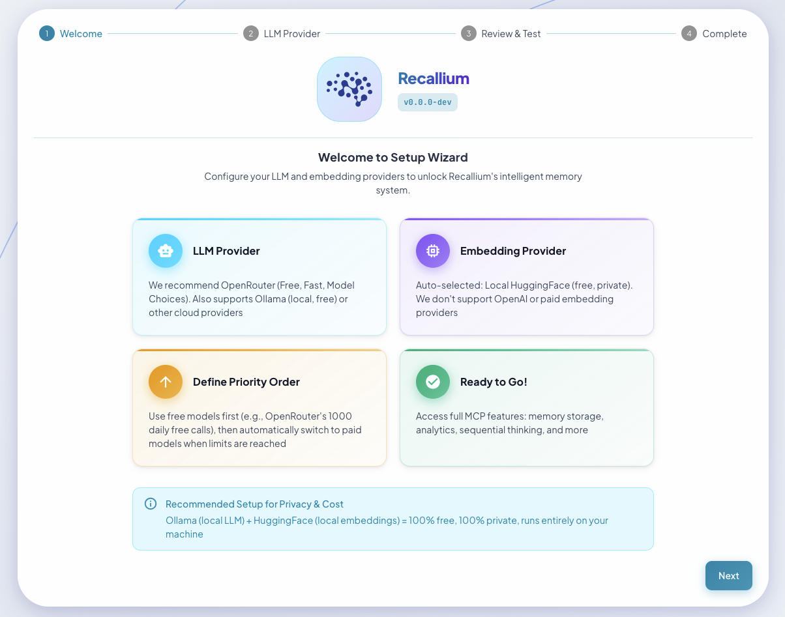
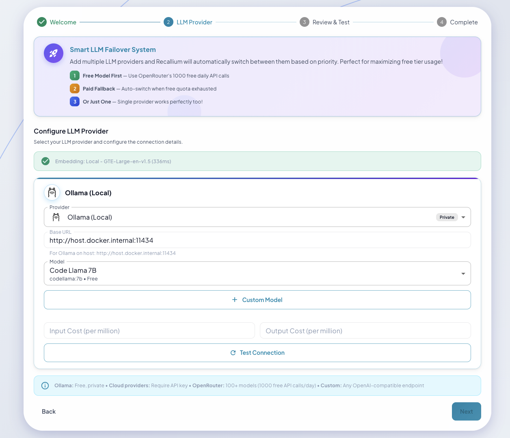
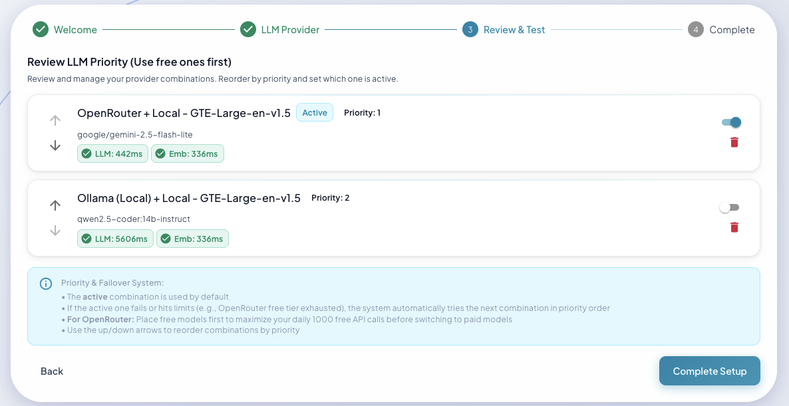
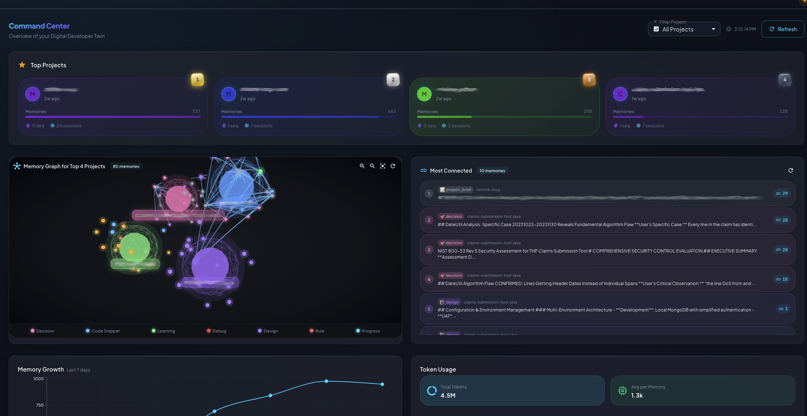

# Recallium Installation Guide

Get Recallium running in **under 2 minutes**.

---

## Quick Overview

**Recallium** is an AI memory and project intelligence server that gives your IDE agents persistent memory. It uses the **Model Context Protocol (MCP)** to store, search, and reason about your code, decisions, and project knowledge—creating a digital twin that grows smarter over time.

| Feature | What You Get |
|---------|--------------|
| **Persistent Memory** | Decisions, patterns, learnings saved across sessions |
| **Cross-Project Intelligence** | Lessons learned once → applied everywhere |
| **Document Knowledge Base** | Upload PDFs, specs → AI understands instantly |
| **16 MCP Tools** | Full toolkit for IDE agents |
| **Web Dashboard** | 18-page UI for management and insights |

---

## Free Local Option (No API Keys!)

Want to run completely free and private? **Use Ollama + built-in embeddings:**

```
LLM: Ollama (Llama 3, Mistral, Qwen - runs locally)
Embeddings: GTE-Large (built-in, no API needed)
Cost: $0
```

Just install Ollama, pull a model, and select it in the Setup Wizard. Your data never leaves your machine.

---

## IDE Support At-a-Glance

| Connection Type | IDEs | Setup |
|-----------------|------|-------|
| **HTTP Direct** (recommended) | Cursor, VS Code, Claude Code, Claude Desktop, Windsurf, Roo Code, Visual Studio 2022 | Just add URL to config |
| **npm Client** (stdio→HTTP bridge) | Zed, JetBrains, Cline, BoltAI, Augment Code, Warp, Amazon Q | Install `npm install -g recallium` first |

---

## Prerequisites

### 1. Docker
[Install Docker](https://docs.docker.com/get-docker/) for your platform.

### 2. Ollama (for free local AI)

**Install Ollama:**

```bash
# macOS
brew install ollama

# Linux
curl -fsSL https://ollama.ai/install.sh | sh

# Windows
# Download from https://ollama.ai/download
```

**Start Ollama:**
```bash
ollama serve
```

### 3. Pull Required Models

```bash

# Required for insights (or use OpenAI/Anthropic)
ollama pull qwen2.5-coder:7b
```


---

## Note: No npm Client Needed (For Most IDEs)

**Recallium now uses HTTP transport** - most modern IDEs connect directly to the Docker container:

**No npm client needed (HTTP or Extension)**: Cursor, VS Code, Claude Code, Claude Desktop, Windsurf, and 10+ other IDEs

**npm client required (STDIO→HTTP bridge)**: Zed, JetBrains, Cline, BoltAI, and other command-only IDEs

If your IDE requires the npm client (see IDE Integration section below), install it:

```bash
npm install -g recallium
```

---

## Quick Start

### macOS / Linux (30 Seconds)

```bash
cd install
chmod +x start-recallium.sh
./start-recallium.sh
```

**What the script does:**
1. Check Docker is installed and running
2. Verify `recallium.env` exists
3. Stop and remove any existing container
4. Pull the latest image from Docker Hub
5. Start the container with proper configuration
6. Open browser when ready

That's it! Visit http://localhost:9001 to complete setup.

---

### Windows (2 Minutes)

Windows requires additional Ollama configuration for Docker connectivity.

**Step 1: Configure Ollama Environment Variable (one-time setup)**

1. Open "Edit the system environment variables" (search in Start menu)
2. Click "Environment Variables"
3. Under "System variables" → Click "New"
4. Variable name: `OLLAMA_HOST`
5. Variable value: `0.0.0.0:11434`
6. Click OK → OK
7. **Restart Ollama** (close and reopen the application)

**Step 2: Add Windows Firewall Rule (one-time setup)**

Open Command Prompt or PowerShell **as Administrator** and run:

```cmd
netsh advfirewall firewall add rule name="Ollama" dir=in action=allow program="C:\Users\<YOUR_USERNAME>\AppData\Local\Programs\Ollama\ollama.exe" enable=yes profile=private
```

Replace `<YOUR_USERNAME>` with your Windows username.

**Step 3: Start Recallium**

```cmd
cd install
start-recallium.bat
```

**What the script does:**
1. Check Docker is installed and running
2. Verify `recallium.env` exists
3. Stop and remove any existing container
4. Pull the latest image from Docker Hub
5. **Auto-detect your IP address** and update `OLLAMA_HOST`/`OLLAMA_BASE_URL` in `recallium.env`
6. Start the container with proper configuration
7. Open browser when ready

Visit http://localhost:9001 to complete setup.

---

### Alternative: Docker Compose (More Control)

Use docker-compose if you want more control or need to customize the setup.

```bash
cd install
docker compose --env-file recallium.env pull    # Download latest image
docker compose --env-file recallium.env up -d   # Start container
```

> **Windows users:** If using docker-compose instead of `start-recallium.bat`, you must manually update `recallium.env` with your IP address:
> ```
> OLLAMA_HOST=http://YOUR_IP:11434
> OLLAMA_BASE_URL=http://YOUR_IP:11434
> ```
> Find your IP with: `ipconfig | findstr "IPv4"`

**Advantages of docker-compose:**
- Easier to customize (edit `docker-compose.yml`)
- Standard Docker workflow
- Better for integration with other services

---

### Port Configuration (Optional)

Default ports work for most users. Only change if you have conflicts.

Edit `recallium.env` **before** starting:

```bash
HOST_UI_PORT=9001        # Web UI: http://localhost:9001
HOST_API_PORT=8001       # MCP API: http://localhost:8001
HOST_POSTGRES_PORT=5433  # PostgreSQL: localhost:5433
VOLUME_NAME=recallium-v1 # Data volume name
```

**Port mapping:**
| Your Machine | Container | Service |
|--------------|-----------|---------|
| HOST_UI_PORT (9001) | 9000 | Web UI |
| HOST_API_PORT (8001) | 8000 | MCP API |
| HOST_POSTGRES_PORT (5433) | 5432 | PostgreSQL |

**Important:** If you change `HOST_API_PORT`, update your IDE's MCP configuration to match.

---

**That's it!** Access Recallium at:
- **Web UI**: http://localhost:9001 (or your configured HOST_UI_PORT)
- **MCP API**: http://localhost:8001 (or your configured HOST_API_PORT)
- **Health Check**: http://localhost:8001/health

### 30-Second Verification

```bash
# 1. Check container is running
docker ps -f name=recallium

# 2. Verify health endpoint
curl http://localhost:8001/health
# Expected: {"status":"healthy",...}

# 3. Check MCP tools are available
curl http://localhost:8001/mcp/status
# Expected: List of 16 available tools

# 4. Open the Web UI
open http://localhost:9001   # macOS
# or visit http://localhost:9001 in your browser
```

If all checks pass, proceed to the Setup Wizard!

---

## Setup Wizard (First-Time Configuration)

On first launch, visit **http://localhost:9001** to complete the setup wizard:


*The Setup Wizard guides you through initial configuration*

### 1. Choose Your LLM Provider


*Select from 5 supported LLM providers*

Recallium works with **any LLM provider**—use what you already have:

| Provider | Models | Notes |
|----------|--------|-------|
| **Anthropic** | Claude 3.5 Sonnet, Claude 3 Opus/Sonnet/Haiku | Recommended for best results |
| **OpenAI** | GPT-4o, GPT-4 Turbo, GPT-3.5 Turbo | Function calling, streaming |
| **Google Gemini** | Gemini 1.5 Pro, Gemini 1.5 Flash | Multi-modal support |
| **Ollama** | Llama 3, Mistral, Qwen, any local model | **Free, runs locally** |
| **OpenRouter** | 100+ models via single API | Access any model |

### 2. Test Your Configuration

The setup wizard lets you:
- **Test API keys** before saving
- **Verify connectivity** to your chosen provider
- **Switch providers anytime** without losing data


*Configure provider priority and automatic failover*

### 3. Complete Setup

Once configured, the MCP tools become available to all connected IDEs.


*After setup: Your dashboard shows system stats, recent activity, and quick access to all features*

### Free Local Setup (No API Keys Required)

Want to run completely free and private?

```
LLM: Ollama (local models like Llama 3, Mistral)
Embeddings: GTE-Large (built-in, runs locally)
```

Just select Ollama in the setup wizard and ensure Ollama is running locally.

---

## Configuration

The `recallium.env` file contains all configuration options. Key settings:

### Database (Required)
```bash
POSTGRES_PASSWORD=recallium_password  # Change in production!
```

### LLM Provider (5 Options)

**Configure via Setup Wizard at http://localhost:9001**

API keys are securely vaulted inside your Docker container—never stored in plain text files.

| Provider | Models | Notes |
|----------|--------|-------|
| **Ollama** | Llama 3, Mistral, Qwen, any local model | **Free, local** - Default |
| **Anthropic** | Claude 3.5 Sonnet, Claude 3 Opus/Sonnet/Haiku | Recommended for best results |
| **OpenAI** | GPT-4o, GPT-4 Turbo, GPT-3.5 Turbo | Function calling, streaming |
| **Google Gemini** | Gemini 1.5 Pro, Gemini 1.5 Flash | Multi-modal support |
| **OpenRouter** | 100+ models via single API | Access any model |

The Setup Wizard lets you:
- **Test API keys** before saving
- **Switch providers** anytime without losing data
- **Configure failover** providers for reliability

### Ports (Host Mappings)
```bash
HOST_UI_PORT=9001        # Access UI on your machine
HOST_API_PORT=8001       # Access MCP API on your machine
HOST_POSTGRES_PORT=5433  # Access PostgreSQL on your machine
```

See `recallium.env` for all available options with detailed inline documentation.

---

## Advanced Configuration

All configuration is managed through `recallium.env` (single source of truth). Common customizations:

### Change LLM Model
```bash
# Edit install/recallium.env
LLM_MODEL=llama3.2:3b           # Smaller, faster
# or
LLM_MODEL=gpt-oss:20b           # Larger, more accurate
```

### Adjust Document Chunk Size
```bash
# Edit install/recallium.env
CHUNK_SIZE_TOKENS=400           # Safe with 22% margin (recommended)
CHUNK_SIZE_TOKENS=450           # Moderate margin
```

### Change Processing Settings
```bash
# Edit install/recallium.env
BATCH_SIZE=20                   # Process more memories at once
MAX_CONCURRENT=10               # More parallel operations
QUEUE_WORKERS=3                 # More background workers
```

### Switch LLM Providers

Use the **Setup Wizard** at http://localhost:9001 → Providers

- Add new provider credentials securely (vaulted, not in plain text)
- Test connectivity before saving
- Switch active provider instantly
- Configure fallback providers

No container restart required—changes take effect immediately.

### Disable Features
```bash
# Edit install/recallium.env
ENABLE_PATTERN_MATCHING=false   # Skip pattern detection
ENABLE_UNIFIED_INSIGHTS=false   # Disable insights processing
REAL_TIME_PROCESSING=false      # Queue for batch processing
```

**After editing `recallium.env`, restart the container:**
```bash
cd install
docker compose down
docker compose --env-file recallium.env up -d
```

---

## IDE Integration

Recallium supports two connection methods:

### HTTP-Capable IDEs (Recommended - No npm Client)

These IDEs connect directly to `http://localhost:8001/mcp`:

<details>
<summary><b>Install in Cursor</b></summary>

Go to: `Settings` → `Cursor Settings` → `MCP` → `Add new global MCP server`

**Configuration:**

```json
{
  "mcpServers": {
    "recallium": {
      "url": "http://localhost:8001/mcp",
      "transport": "http"
    }
  }
}
```

**Or manually edit config file:**

**File location:**
- macOS: `~/.cursor/mcp.json`
- Windows: `%APPDATA%\Cursor\mcp.json`
- Linux: `~/.config/cursor/mcp.json`

**Verification:**
1. Restart Cursor after adding configuration
2. Test with: "Use the store_memory tool to save this information"
3. Recallium tools should appear in the AI assistant

</details>

<details>
<summary><b>Install in VS Code</b></summary>

**Prerequisites:**
- VS Code version 1.102+ (or VS Code Insiders 1.103+)
- GitHub Copilot Chat extension v0.29+

**Method 1: Using Command Palette (Recommended)**

1. Press `Ctrl/Cmd + Shift + P`
2. Type and select: `MCP: Add Server`
3. Choose: `HTTP`
4. Enter URL: `http://localhost:8001/mcp`
5. Enter name: `recallium`

**Method 2: Manual Configuration**

Add this to your VS Code MCP config file:

**File location:**
- macOS: `~/Library/Application Support/Code/User/mcp.json`
- Windows: `%APPDATA%\Code\User\mcp.json`
- Linux: `~/.config/Code/User/mcp.json`

```json
{
  "mcp": {
    "servers": {
      "recallium": {
        "type": "http",
        "url": "http://localhost:8001/mcp"
      }
    }
  }
}
```

**Workspace-Specific Configuration (Optional):**

Create `.vscode/mcp.json` in your project root to override global settings for that workspace.

**Verification:**
1. Restart VS Code after adding configuration
2. Open GitHub Copilot Chat (click chat icon in sidebar)
3. Type "Use MCP tools to search my memories"
4. You should see Recallium tools being used

See [VS Code MCP docs](https://code.visualstudio.com/docs/copilot/chat/mcp-servers) for more info.

</details>

<details>
<summary><b>Install in Claude Code</b></summary>

Run this command to add Recallium with HTTP transport:

```bash
claude mcp add --transport http recallium http://localhost:8001/mcp
```

**Verification:**
```bash
# List installed MCP servers
claude mcp list

# Test connection
claude mcp test recallium
```

See [Claude Code MCP docs](https://docs.anthropic.com/en/docs/claude-code/mcp) for more info.

</details>

<details>
<summary><b>Install in Windsurf</b></summary>

Add this to your Windsurf MCP config file:

```json
{
  "mcpServers": {
    "recallium": {
      "serverUrl": "http://localhost:8001/mcp"
    }
  }
}
```

</details>

<details>
<summary><b>Install in Roo Code</b></summary>

Add this to your Roo Code MCP configuration file:

```json
{
  "mcpServers": {
    "recallium": {
      "type": "streamable-http",
      "url": "http://localhost:8001/mcp"
    }
  }
}
```

</details>

<details>
<summary><b>Install in Visual Studio 2022</b></summary>

Add this to your Visual Studio MCP config file. See [Visual Studio MCP docs](https://learn.microsoft.com/visualstudio/ide/mcp-servers) for details:

```json
{
  "inputs": [],
  "servers": {
    "recallium": {
      "type": "http",
      "url": "http://localhost:8001/mcp"
    }
  }
}
```

</details>

<details>
<summary><b>Other HTTP-Capable IDEs</b></summary>

Recallium also works with:
- **Gemini CLI** - Use `httpUrl: "http://localhost:8001/mcp"`
- **Qodo Gen** - Use `type: "remote", url: "http://localhost:8001/mcp"`
- **Opencode** - Use `type: "remote", url: "http://localhost:8001/mcp"`
- **Trae** - Use `url: "http://localhost:8001/mcp"`
- **Copilot Coding Agent** - Use `type: "http", url: "http://localhost:8001/mcp"`

Refer to your IDE's MCP documentation for exact configuration syntax.

</details>

<details>
<summary><b>Install in Claude Desktop</b></summary>

**Steps to Configure:**

1. **Download the JSONB extension file** from the Recallium release or create one with the Recallium MCP configuration

2. **Install as Extension:**
   - Open Claude Desktop
   - Go to **Settings → Extensions**
   - Click **Browse Extensions**
   - Click **Add Custom**
   - Browse to and select the `.jsonb` file to install

3. **Enable Recallium tools:**
   - After installation, go to **Connectors → Recallium**
   - Enable each tool you want to use

4. **Verify connection:**
   - Try using a Recallium tool (e.g., `get_rules` with `project_name: "__global__"`)
   - Check Claude Desktop logs if tools don't appear

**Troubleshooting:**
- If tools don't appear, verify the Docker container is running: `docker ps -f name=recallium`
- Check Claude Desktop logs for detailed error messages

</details>

### Command-Only IDEs (Requires npm Client)

These IDEs only support command-based connections and need the npm client as a stdio→HTTP bridge:

**First, install the npm client:**
```bash
npm install -g @recallium/mcp-client
```

<details>
<summary><b>Install in Zed</b></summary>

Add this to your Zed `settings.json`. See [Zed Context Server docs](https://zed.dev/docs/assistant/context-servers) for more info.

```json
{
  "context_servers": {
    "recallium": {
      "source": "custom",
      "command": "npx",
      "args": ["-y", "recallium-mcp"],
      "env": {
        "RECALLIUM_SERVER_URL": "http://localhost:8001/mcp"
      }
    }
  }
}
```

See [Zed Context Server docs](https://zed.dev/docs/assistant/context-servers) for more info.

</details>

<details>
<summary><b>Install in JetBrains AI Assistant</b></summary>

See [JetBrains AI Assistant Documentation](https://www.jetbrains.com/help/ai-assistant/configure-an-mcp-server.html) for more details.

1. In JetBrains IDEs, go to `Settings` → `Tools` → `AI Assistant` → `Model Context Protocol (MCP)`
2. Click `+ Add`
3. Click on `Command` in the top-left corner and select `As JSON`
4. Add this configuration and click `OK`:

```json
{
  "mcpServers": {
    "recallium": {
      "command": "npx",
      "args": ["-y", "recallium-mcp"],
      "env": {
        "RECALLIUM_SERVER_URL": "http://localhost:8001/mcp"
      }
    }
  }
}
```

5. Click `Apply` to save changes

See [JetBrains AI Assistant Documentation](https://www.jetbrains.com/help/ai-assistant/configure-an-mcp-server.html) for more info.

</details>

<details>
<summary><b>Install in Cline</b></summary>

Add this to your Cline MCP servers configuration:

```json
{
  "mcpServers": {
    "recallium": {
      "command": "npx",
      "args": ["-y", "recallium-mcp"],
      "env": {
        "RECALLIUM_SERVER_URL": "http://localhost:8001/mcp"
      }
    }
  }
}
```

</details>

<details>
<summary><b>Install in BoltAI</b></summary>

Open the "Settings" page of the app, navigate to "Plugins," and enter the following JSON:

```json
{
  "mcpServers": {
    "recallium": {
      "command": "npx",
      "args": ["-y", "recallium-mcp"],
      "env": {
        "RECALLIUM_SERVER_URL": "http://localhost:8001/mcp"
      }
    }
  }
}
```

More information is available on [BoltAI's Documentation site](https://docs.boltai.com/docs/plugins/mcp-servers).

</details>

<details>
<summary><b>Install in Augment Code</b></summary>

1. Press Cmd/Ctrl Shift P or go to the hamburger menu in the Augment panel
2. Select Edit Settings
3. Under Advanced, click Edit in settings.json
4. Add the server configuration to the `mcpServers` array:

```json
"augment.advanced": {
  "mcpServers": [
    {
      "name": "recallium",
      "command": "npx",
      "args": ["-y", "recallium-mcp"],
      "env": {
        "RECALLIUM_SERVER_URL": "http://localhost:8001/mcp"
      }
    }
  ]
}
```

Once the MCP server is added, restart your editor.

</details>

<details>
<summary><b>Install in Warp</b></summary>

See [Warp MCP Documentation](https://docs.warp.dev/knowledge-and-collaboration/mcp) for details.

1. Navigate `Settings` > `AI` > `Manage MCP servers`
2. Add a new MCP server by clicking the `+ Add` button
3. Paste the configuration given below:

```json
{
  "recallium": {
    "command": "npx",
    "args": ["-y", "recallium-mcp"],
    "env": {
      "RECALLIUM_SERVER_URL": "http://localhost:8001/mcp"
    },
    "working_directory": null,
    "start_on_launch": true
  }
}
```

4. Click `Save` to apply the changes

</details>

<details>
<summary><b>Install in Amazon Q Developer CLI</b></summary>

Add this to your Amazon Q Developer CLI configuration file. See [Amazon Q Developer CLI docs](https://docs.aws.amazon.com/amazonq/latest/qdeveloper-ug/command-line-mcp-configuration.html) for more details.

```json
{
  "mcpServers": {
    "recallium": {
      "command": "npx",
      "args": ["-y", "recallium-mcp"],
      "env": {
        "RECALLIUM_SERVER_URL": "http://localhost:8001/mcp"
      }
    }
  }
}
```

</details>

**Note:** If you changed `HOST_API_PORT` in `recallium.env` from the default `8001`, update the URL in your IDE config accordingly.

## Management Commands

```bash
# View logs
docker compose --env-file recallium.env logs -f

# Stop
docker compose down

# Restart
docker compose --env-file recallium.env restart

# Update to latest version
docker compose --env-file recallium.env pull
docker compose --env-file recallium.env up -d

# Reset everything (deletes all data!)
docker compose down -v
```

## Tips

### Add Rules for Automatic Tool Usage

If you don't want to manually invoke Recallium tools every time, you can define rules in your IDE to automatically use Recallium for specific tasks:

**For Cursor:** `Cursor Settings > Rules` section

**For Claude Code:** In `.clauderc` or `CLAUDE.md` file

**For Windsurf:** In `.windsurfrules` file

#### Example Rule

```txt
Always use recallium MCP tools when working with this codebase. Specifically:
- Use store_memory to capture implementation decisions, learnings, and code context
- Use search_memories to find past decisions and context before making changes
- Use get_rules at the start of each session to load project behavioral guidelines
- Link memories to files using related_files parameter for better code searchability
```

From then on, your AI assistant will automatically use Recallium's persistent memory without you having to explicitly request it.

### Testing with MCP Inspector

You can test and debug your Recallium MCP connection using the official MCP Inspector:

```bash
# Test HTTP connection
npx @modelcontextprotocol/inspector http://localhost:8001/mcp

# Test npm client (stdio→HTTP bridge)
npx @modelcontextprotocol/inspector npx -y recallium-mcp
```

The inspector provides a web interface to:
- List all available tools
- Test tool execution with custom parameters
- View request/response JSON
- Debug connection issues

---

## Troubleshooting

<details>
<summary><b>Ollama Connection Issues</b></summary>

```bash
# Ensure Ollama is running
ollama serve

# Verify models are downloaded
ollama list

# Test Ollama connection
curl http://localhost:11434/api/version
```

If Ollama is running on a different host:
```bash
# Edit install/recallium.env
OLLAMA_HOST=http://your-ollama-host:11434
```

</details>

<details>
<summary><b>Ollama on Windows (Special Configuration Required)</b></summary>

On Windows, Docker containers cannot use `localhost` or `host.docker.internal` to reach Ollama. You must configure Ollama to bind to all interfaces and use your machine's IP address.

**Step 1: Configure Ollama Environment Variable**

1. Open "Edit the system environment variables" (search in Start menu)
2. Click "Environment Variables"
3. Under "System variables" → Click "New"
4. Variable name: `OLLAMA_HOST`
5. Variable value: `0.0.0.0:11434`
6. Click OK → OK
7. **Restart Ollama** (close and reopen)

**Step 2: Add Windows Firewall Rule**

Open Command Prompt or PowerShell as Administrator and run:

```cmd
netsh advfirewall firewall add rule name="Ollama" dir=in action=allow program="C:\Users\<YOUR_USERNAME>\AppData\Local\Programs\Ollama\ollama.exe" enable=yes profile=private
```

Replace `<YOUR_USERNAME>` with your Windows username.

**Step 3: Update recallium.env with Your IP**

The `start-recallium.bat` script will automatically detect your IP address and update the env file. Alternatively, manually find your IP and edit `recallium.env`:

```bash
# Find your IP address
ipconfig | findstr "IPv4"

# Edit recallium.env with your IP (example: 192.168.1.46)
OLLAMA_HOST=http://192.168.1.46:11434
OLLAMA_BASE_URL=http://192.168.1.46:11434
```

**Verify Ollama is Accessible:**

```cmd
curl http://YOUR_IP:11434/api/version
```

</details>

<details>
<summary><b>Port Conflicts</b></summary>

Edit `recallium.env` and change the HOST_* port mappings, then restart:
```bash
# Edit install/recallium.env - change HOST_UI_PORT, HOST_API_PORT, etc.
docker compose down
docker compose --env-file recallium.env up -d
```

**Remember:** If you change `HOST_API_PORT`, you must also update your IDE config to use the new port.

</details>

<details>
<summary><b>Claude Desktop HTTP 406 Errors</b></summary>

If you see "HTTP 406: Not Acceptable" errors in Claude Desktop logs:

1. Update npm client to latest version:
   ```bash
   npm install -g @recallium/mcp-client
   ```

2. Clear npx cache:
   ```bash
   rm -rf ~/.npm/_npx
   npm cache clean --force
   ```

3. Restart Claude Desktop completely

The latest npm client (v1.2.3+) includes the correct Accept headers required by the Recallium server.

</details>

<details>
<summary><b>Tools Not Appearing in IDE</b></summary>

1. Verify Docker container is running:
   ```bash
   docker ps -f name=recallium
   ```

2. Check MCP server health:
   ```bash
   curl http://localhost:8001/health
   curl http://localhost:8001/mcp/status
   ```

3. For HTTP-capable IDEs (Cursor, VS Code):
   - Verify URL ends with `/mcp`: `http://localhost:8001/mcp`
   - Restart your IDE after config changes

4. For command-only IDEs (Claude Desktop, Zed):
   - Ensure npm client is installed: `npm list -g @recallium/mcp-client`
   - Check `RECALLIUM_SERVER_URL` includes `/mcp`: `http://localhost:8001/mcp`

</details>

<details>
<summary><b>Database Connection Issues</b></summary>

```bash
# Check PostgreSQL is running inside container
docker exec recallium pg_isready -U recallium

# View database logs
docker exec recallium tail -f /data/postgres.log

# Connect to database directly
docker exec -it recallium psql -U recallium -d recallium_memories
```

</details>

<details>
<summary><b>View Container Status</b></summary>

```bash
# Check container status
docker ps -f name=recallium

# View all logs
docker logs -f recallium

# Check health endpoint
curl http://localhost:8001/health

# Check MCP status with tool list
curl http://localhost:8001/mcp/status
```

</details>

<details>
<summary><b>Docker Image Issues / Not Getting Latest Version</b></summary>

If you're experiencing issues with the Docker image or not getting the latest version from Docker Hub:

**Force pull latest image and restart:**
```bash
cd install
docker compose down
docker compose --env-file recallium.env up --pull always
```

The `--pull always` flag forces Docker to pull the latest image from Docker Hub, ignoring any cached local images. This is useful when:
- You're not seeing the latest features or fixes
- The image seems corrupted or outdated
- You want to ensure you have the absolute latest version

**Alternative approach:**
```bash
# Remove old image completely and start fresh
docker compose down
docker rmi manujbawa/recallium:latest
docker compose --env-file recallium.env up -d
```

</details>

<details>
<summary><b>npm Client Issues (Claude Desktop, Zed, JetBrains)</b></summary>

**Module not found errors:**
```bash
# Reinstall npm client
npm uninstall -g @recallium/mcp-client
npm install -g @recallium/mcp-client

# Verify installation
npm list -g @recallium/mcp-client
recallium-mcp --version
```

**Connection timeout:**
```bash
# Test npm client directly
RECALLIUM_DEBUG=true RECALLIUM_SERVER_URL=http://localhost:8001/mcp recallium-mcp
```

**Wrong Node.js version:**
The npm client requires Node.js >= 18. Check your version:
```bash
node --version
```

</details>

## Next Steps

1. **Complete Setup Wizard**: Visit http://localhost:9001 to configure your LLM provider
2. **Configure IDE**: Follow the IDE Integration guides above
3. **Start Using**: Your AI now has persistent memory across sessions!

### Your First Commands (Try These in Your IDE!)

Once your IDE is connected, try these commands with your AI assistant:

```
"recallium"
→ Magic summon: loads all your project context in one call

"Store a memory: We decided to use PostgreSQL because..."
→ Saves your decision with auto-tagging

"Search my memories about authentication"
→ Finds past decisions, patterns, learnings

"What was I working on last week?"
→ Session recap with recent activity

"Get insights about my database patterns"
→ Cross-project pattern analysis
```

### What You Can Do Now

| Capability | Example |
|------------|---------|
| **Store memories** | Decisions, patterns, learnings automatically preserved |
| **Search across projects** | Find past context instantly |
| **Get insights** | Pattern analysis across your work |
| **Link projects** | Share knowledge between related projects |
| **Upload documents** | PDFs, docs become searchable knowledge |
| **Manage tasks** | Track TODOs with linked memories |
| **Structured thinking** | Document complex problem-solving |

---
